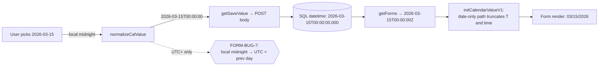
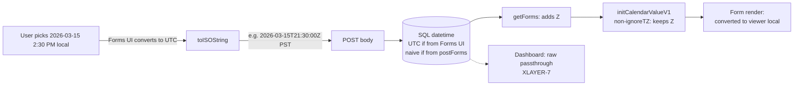
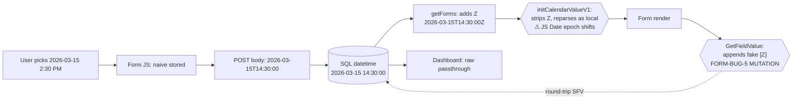

# WADNR Date Handling — Current State Report

| Field              | Value                                                                                                         |
| ------------------ | ------------------------------------------------------------------------------------------------------------- |
| **Prepared by**    | Emanuel Jofré — Solution Architecture                                                                          |
| **Date**           | 2026-04-16                                                                                                    |
| **Phase**          | 1 (BRT/IST evidence proxied to PST/EST/UTC; Phase 2 will backfill with native PST/EST runs — see Part 8)      |
| **Audience**       | Engineering and architecture leadership                                                                        |
| **Distribution**   | Internal. Suitable to ship as-is to VV Product / Engineering if escalated.                                    |
| **Environment**    | vv5dev / WADNR / fpOnline · Platform 6.1.20240711.1 · Server UTC-7 · FormViewer v0.5.1 (build 20260404.1)     |
| **Investigation**  | [`research/date-handling/`](../../../research/date-handling/) — 16 confirmed platform bugs, 4 temporal models |

---

## How to Read This

- **Part 0** is the bottom line. 5 minutes.
- **Part 1** is the architecture primer — read once, refer back often.
- **Part 2** is WADNR's config inventory — how many fields, which configs, what's intended, what's misconfigured.
- **Part 3** is the **layer catalogue** — reference map of every transformation point a date passes through. Not meant to be read top-to-bottom; use as lookup.
- **Part 4** is **the core**: per-config scenario walkthroughs. For each config WADNR actually uses (B, C, D), 11 scenarios trace a concrete date value through every layer, in PST / EST / UTC. This is the "what actually happens" section.
- **Part 5** lists the 18 cross-layer inconsistencies catalogued platform-wide, WADNR-annotated.
- **Part 6** is the risk register and recommendations.
- **Part 7** lists validation evidence; **Part 8** lists Phase 2 follow-up work.
- **Appendices** hold the full 8-config matrix, complete WADNR field inventory, #124697 case study, source pointers, and a glossary.

All cross-references use relative paths from this file. Every claim has a citation of the form `[src: path#section]`.

---

# Part 0 — Executive Summary

**WADNR has 137 calendar fields across 35 form templates.** Three platform configurations are in use: **Config B (date-only, 119 fields, 86.9%)**, **Config D (date+time pinned, 12 fields, 8.8%)**, **Config C (date+time instant, 3 fields, 2.2%)**. No legacy (E–H) configurations are in production. [src: `analysis/field-inventory.md#summary`]

**Testing validates that WADNR behaves identically to the baseline environment.** There are no WADNR-specific date bugs. All issues are platform defects common to every VV customer running the same version. [src: `testing/date-handling/status.md`]

## Top-5 risks, prioritized

| # | Risk                                                                                                                                                         | Layer(s)                                  | Status                                                                                                 | WADNR surface                                                 |
| - | ------------------------------------------------------------------------------------------------------------------------------------------------------------ | ----------------------------------------- | ------------------------------------------------------------------------------------------------------ | ------------------------------------------------------------- |
| 1 | **Freshdesk #124697 (WADNR-10407)** — `postForms` writes Config D value correctly; on first form open the browser re-parses and shifts; save commits drift. | REST API serialization + Form JS load    | **Active in production.** Workaround: use `forminstance/` endpoint for legacy-data migration.         | All 12 Config D fields across 8 form templates.               |
| 2 | **FORM-BUG-5 drift on script round-trip** — `GetFieldValue` → `SetFieldValue` on a Config D field shifts the value by the user's UTC offset, per trip.       | Dev API (`GetFieldValue` / `SetFieldValue`) | Reproducible in every timezone except UTC+0. **No WADNR template scripts currently do GFV→SFV** on D fields; site-level `FillinAndRelateForm` is uninspected. | All 12 Config D fields if a script round-trip is introduced.  |
| 3 | **Mixed-TZ storage accretion** — same `fpOnline` column holds UTC-normalized values (from UI with `ignoreTimezone=false`) and naive-local values (from `postForms` / Config D UI). | SQL Server `datetime` + server storage    | **Structural, ongoing.** Every new record widens the mix.                                              | All date columns. Affects date-range queries and dashboards.  |
| 4 | **8 misconfigured Config D fields** — `"Date of Receipt"`, `"Received Date"`, `"Date Created"`, `"Date of Violation"` etc. are configured with `enableTime=true` but names indicate date-only semantics. | Form template definition                 | Configuration error. Not a platform bug.                                                               | 8 specific fields across 7 templates (Appendix B).            |
| 5 | **FORM-BUG-7 — date-only wrong day for UTC+ users** — 122 Config B fields store the previous day for any user east of UTC.                                   | Form JS input parsing (`normalizeCalValue`) | **Dormant**: WADNR staff are Pacific (UTC-7/-8). Would activate for UTC+ contractors, travelers, or legacy-source migrations that carried UTC+ semantics. | All 122 date-only fields; latent risk.                        |

## Exposure in one paragraph

A single date value in WADNR can traverse up to **11 distinct transformation points** between user keystroke and database row, and between database row and rendered display. Five of these layers are known mutation points (places where the value or its semantics change without a warning). The platform has no per-row metadata to identify *which* temporal model a stored `datetime` represents — so the same column accumulates Calendar Date, Instant, and Pinned/Floating values mixed together, each serialized and rendered under whatever convention the reading endpoint happens to apply. WADNR's `fpOnline` database is inside this regime; one active support ticket (#124697) has already exposed the problem, the workaround addresses only one of three affected stages, and future WADNR records created via the standard `postForms` endpoint or via `VV.Form.Global.FillinAndRelateForm` site-level chains remain exposed. [src: `research/date-handling/analysis/temporal-models.md#5-how-bugs-compound-across-layers`]

## What's been validated

| Component       | Slots | Executed | PASS | FAIL | BLOCKED | Notes                                                                                                      |
| --------------- | ----: | -------: | ---: | ---: | ------: | ---------------------------------------------------------------------------------------------------------- |
| Forms Calendar  |   269 |      149 |  135 |   11 |       0 | Cat 1–12 BRT-Chromium 116/116 PASS. Cat 10 (WS input) 0P/6F — FORM-BUG-5 + WS-BUG-5.                       |
| Web Services    |   148 |      148 |  130 |   18 |       0 | All 6 WS bugs + FORM-BUG-7 + CB-29 confirmed as platform-level.                                            |
| Dashboards      |    44 |       35 |   27 |    8 |       9 | FORMDASHBOARD-BUG-1 confirmed. DB-5 filter test blocked (toolbar not enabled). DB-3 D–H needs IST browser. |
| **Total**       | **461** | **332** | **292** | **37** | **9** | **88% pass rate of executed** — all failures map to documented platform bugs.                          |

[src: `testing/date-handling/status.md`]

## What to do

- **Keep the `forminstance/` workaround** for ongoing legacy-data migration (#124697 root-mitigation).
- **Audit the 8 misconfigured Config D fields** (Appendix B, Table B.2) and decide per-field whether to reconfigure to B. Reconfiguration is a write to each form template; it is **not** a data-migration problem (existing records retain their time component in the column but it is hidden by the UI).
- **Ban `GetFieldValue → SetFieldValue` round-trips on Config D fields** in any new template script, and inspect `VV.Form.Global.FillinAndRelateForm` (site-level, currently un-audited, used in 36 templates).
- **Escalate to VV Engineering** with the `platform-date-bugs-summary.md` and `temporal-models.md` documents — the issues are architectural and the fix is coordinated across storage, serialization, form JS, and render layers.

---

# Part 1 — The Pipeline: How a Date Moves Through VV

## 1.1 Full lifecycle diagram

A date value in VV crosses up to 11 layers between user keystroke and re-rendered display. The diagram below shows the write path (top) and read path (bottom) for Forms. Each labelled node is a place where the value, its semantics, or its format can change.

```mermaid
sequenceDiagram
    autonumber
    actor U as User (browser TZ)
    participant W as Kendo Widget (input layer)
    participant FJS as Form JS (parseDateString, normalizeCalValue, getSaveValue)
    participant HTTP as HTTPS / JSON
    participant API as REST API endpoint<br/>(postForms / forminstance/ / getForms)
    participant SRV as ASP.NET server
    participant DB as SQL Server datetime<br/>(fpOnline, no TZ metadata)
    participant DAPI as Dev API<br/>(GetFieldValue / SetFieldValue / GetDateObject)
    participant DB2 as Dashboard (Telerik)
    participant DOC as Doc Library index field

    U->>W: types or picks date
    W->>FJS: DOM value (locale string)
    FJS->>FJS: normalizeCalValue / getSaveValue<br/>(mutation points: FORM-BUG-7, FORM-BUG-4)
    FJS->>HTTP: POST body (JSON)
    HTTP->>API: postForms / forminstance/ (divergent endpoints)
    API->>SRV: write path
    SRV->>DB: INSERT datetime (naive)

    Note over DB: same column: UTC values (Config C from UI) +<br/>naive local values (Config D from UI, anything from API)

    DB->>SRV: SELECT datetime (naive)
    SRV->>API: serialize (Z appended by getForms;<br/>Z omitted by forminstance/)
    API->>HTTP: GET response (JSON)
    HTTP->>FJS: initCalendarValueV1<br/>(mutation points: FORM-BUG-1, FORM-BUG-3)
    FJS->>W: render value
    W->>U: display (format per Kendo)
    DAPI-->>FJS: GetFieldValue (adds fake [Z] on Config D — FORM-BUG-5)
    DB-->>DB2: Dashboard reads raw (passthrough — XLAYER-7)
    DB-->>DOC: Doc Library (DOC-BUG-1 converts offset to UTC, strips Z)
```

[src: `research/date-handling/analysis/consistency-matrix.md` §1–6; `temporal-models.md` §5]

## 1.2 The 4 temporal models (WADNR uses 3)

Every date/time use case in VV maps to exactly one of four models. The platform supports all four using a single SQL `datetime` column, with no per-row discriminator telling downstream layers which model applies. [src: `research/date-handling/analysis/temporal-models.md#1-the-four-models`]

| Model                    | Example                                   | Storage (correct)                  | Display (correct)                | VV config           | Used at WADNR? |
| ------------------------ | ----------------------------------------- | ---------------------------------- | -------------------------------- | ------------------- | -------------- |
| **1. Calendar Date**     | Due date, "Date of Receipt", birthday     | `YYYY-MM-DD` (no time)             | Show as-is, no conversion        | Config A/B (/E/F)   | **Yes — 122 fields (Config B) + some misconfigured D.** |
| **2. Instant**           | `createdAt`, audit trail                  | UTC with explicit `Z` or offset    | Convert to viewer's local zone   | Config C (/G)       | Yes — 3 fields (Config C).                              |
| **3. Pinned DateTime**   | "Incident at 15:30 São Paulo time"        | Naive datetime + anchor timezone   | Show as-is (with zone label)     | Config D (/H)       | Yes — 4 legitimately pinned (e.g. `ViolationDateAndTime`). |
| **4. Floating DateTime** | "Take medication at 8 AM local"           | Naive datetime, no TZ              | Show as-is in viewer's zone      | Shares Config D/H   | None known; D is used for Pinned semantics.             |

**None of these four models is correctly implemented end-to-end today.** Every config has at least one code path that violates the model's semantics. [src: `temporal-models.md#3-current-state-per-model`]

## 1.3 Why dates are fragile in VV (4 structural reasons)

1. **SQL Server `datetime` has no TZ metadata.** The column holds UTC values, naive-local values, and "date-only" values (with `00:00:00` time) in the same rows. The DB preserves whatever it receives; it cannot distinguish them afterward. [src: `temporal-models.md#61-no-calendar-date-storage-type`]
2. **`getForms` appends `Z` to every serialized datetime**, regardless of whether the stored value is UTC or naive-local. Any consumer that trusts the `Z` will misinterpret naive values as UTC. This is the direct cause of `WS-BUG-1 / CB-29` and of Stage 2 of the #124697 chain. [src: `research/date-handling/web-services/analysis/ws-bug-1-cross-layer-shift.md`]
3. **Form load (`initCalendarValueV1`) strips `Z` and reparses** for Configs D/H, which in many paths causes a JS `Date` object whose internal UTC epoch differs from what the user sees. On save, `toISOString()` then serializes that epoch back, shifting the stored value by the user's offset. This is how a "load-and-save" on a `postForms`-created Config D record mutates the DB. [src: `research/date-handling/forms-calendar/analysis/bug-1-timezone-stripping.md`]
4. **The `forminstance/` endpoint, the Dashboard, the Document Library, and the Dev API each use a different convention**. Same DB row, five different serialized representations across layers. No shared contract. [src: `consistency-matrix.md` §6]

---

# Part 2 — WADNR Configuration Snapshot

## 2.1 Field distribution

**137 calendar fields across 35 form templates.** Distribution is heavily skewed to Config B (date-only) because most WADNR fields represent filing dates, receipt dates, and deadlines. [src: `analysis/field-inventory.md#summary`]

| Config | `enableTime` | `ignoreTimezone` | `useLegacy` | Intended Model         | WADNR fields | % of total | % correctly named |
| :----: | :----------: | :--------------: | :---------: | ---------------------- | -----------: | ---------: | ----------------: |
| **A**  |    false     |      false       |    false    | 1 — Calendar Date      |            3 |       2.2% |               100% |
| **B**  |    false     |      **true**    |    false    | 1 — Calendar Date      |        **119** |   **86.9%** |               ~95% (5 `Status Updated At` fields likely should be C) |
| **C**  |    **true**  |      false       |    false    | 2 — Instant            |            3 |       2.2% |               67% (1 ambiguous) |
| **D**  |    **true**  |      **true**    |    false    | 3/4 — Pinned/Floating  |       **12** |       8.8% |               33% (**8 likely mis-configured**, should be B) |
| E/F/G/H | —            | —                | true        | (legacy variants)       |            0 |       0.0% | —                 |
| **Total** |           |                  |             |                        |      **137** |     100%   |                    |

**Critical callout — the 8 misconfigured Config D fields** (names indicate date-only semantics but `enableTime=true` is set):

| Form template                                     | Field name                   |
| ------------------------------------------------- | ---------------------------- |
| Forest-Practices-Aerial-Chemical-Application       | `Received Date`              |
| Forest-Practices-Application-Notification          | `Date of Receipt`            |
| FPAN-Amendment-Request                             | `Date of Receipt`            |
| FPAN-Renewal                                       | `Date of Receipt`            |
| Long-Term-Application-5-Day-Notice                 | `Date of Receipt`            |
| Multi-purpose                                      | `Date of Violation`          |
| Step-1-Long-Term-FPA                               | `Date of Receipt`            |
| Task                                               | `Date Created`               |

These 8 fields are the primary attack surface for #124697. Full list with all 12 Config D fields in Appendix B. [src: `analysis/bug-analysis/case-study-124697.md#2-production-fields`]

## 2.2 What each config means, in plain English

- **Config B (date-only + ignore TZ)** — "Store a calendar date. Do not apply any timezone math." The picker shows a calendar only; the stored value is `YYYY-MM-DDT00:00:00` (time portion zero). Safe for UTC-users. **Unsafe for UTC+ users** (FORM-BUG-7 stores the previous calendar day).
- **Config C (date+time + respect TZ — Instant)** — "Store a specific moment in time. UI converts the user's local selection to UTC on save, converts UTC back to local on display." The only WADNR config that does real TZ conversion in the Forms UI.
- **Config D (date+time + ignore TZ — Pinned)** — "Store a wall-clock reading without any TZ conversion." Intended for "the incident occurred at 15:30 local time." This is the config at the center of #124697 and the most fragile config overall.

## 2.3 Bug exposure, filtered to WADNR's 3 configs

| Bug ID       | Name                                                                   | Severity | B          | C          | D          | Live in WADNR?                          |
| ------------ | ---------------------------------------------------------------------- | :------: | :--------: | :--------: | :--------: | --------------------------------------- |
| FORM-BUG-1   | Z stripped on form load (Config D/H only)                              |  MED–HI  |    —       |    —       | **YES**    | **Active** (stage 2 of #124697).        |
| FORM-BUG-3   | V2 hardcoded params (code-only)                                        |   MED    |   code     |   code     |   code     | V2 not activated — inert at WADNR.      |
| FORM-BUG-4   | `getSaveValue` strips Z on save                                        |   MED    |    —       |   code     |   code     | Self-consistent within a single user/zone; surfaces on cross-TZ or mixed-endpoint reads. |
| FORM-BUG-5   | Fake literal `[Z]` in `GetFieldValue` (Config D only)                  |  **HIGH**|    —       |    —       | **YES**    | **Active** if any script does GFV→SFV. No template-level round-trips found; `FillinAndRelateForm` uninspected. |
| FORM-BUG-6   | Empty Config C/D returns `"Invalid Date"` from `GetFieldValue`          |   MED    |    —       |  **YES**   |  **YES**   | Any script that checks "is this field empty" via GFV will mis-classify. |
| FORM-BUG-7   | Date-only stored as previous day for UTC+ users                        |  **HIGH**| **YES**    |    —       |    —       | **Dormant** (WADNR staff UTC-7/-8). Would activate for UTC+ users/migrations. |
| WS-BUG-1/CB-29 | `getForms` appends Z to all dates (false UTC marker)                 |   HIGH   | indirect   | indirect   | **YES**    | **Active** — drives #124697 stage 1.    |
| WS-BUG-4     | `postForms` vs `forminstance/` serialize differently                   |   MED    |  YES       |  YES       |  **YES**   | **Active** — direct cause of why the workaround works. |
| WS-BUG-5     | Time component silently truncated for some formats                     |   MED    |    —       |  YES       |  YES       | Active on Cat 10 runs.                  |
| WS-BUG-6     | Date-only fields accept time components (no enforcement)               |   MED    |  YES       |    —       |    —       | Active — allows mis-configured data.    |
| FORMDASHBOARD-BUG-1 | Dashboard shows raw DB value; Forms converts (Config C only)    |   MED    |    —       |  **YES**   |    —       | Active on 3 Config C fields.            |
| DOC-BUG-1/2  | Document Library index field: TZ-to-UTC conversion + can't clear       |   HIGH/MED |    ?       |    ?       |    ?       | Exposure unknown — no WADNR harness yet. |

Legend: `YES` = confirmed live in WADNR, `code` = confirmed in source, not live-reproduced, `—` = not applicable, `indirect` = triggers via a downstream chain.

[src: `research/date-handling/forms-calendar/analysis/overview.md#quick-reference-configuration-impact-matrix`]

---

# Part 3 — Layer Catalogue (Reference)

Every layer below is a place where a date value or its semantics **can** change. Mutation points are marked **MUTATION**. Layers appear in the order they are reached on a write-then-read cycle starting from the user's browser.

## 3.1 — Input Layer (Kendo widget / keyboard)

**What it is.** The UI control that accepts the user's date. WADNR uses **Kendo v1 calendar** widgets in Forms (confirmed via Cat 15 — v1 and v2 behave equivalently for all tested slots). Dashboards use **Telerik** controls server-side. [src: `research/date-handling/forms-calendar/matrix.md` §Cat 15]

**Transformation.** None at this layer — the widget simply hands the DOM input value to Form JS. It does not parse, timezone-shift, or reformat.

**Known issues.** **FORM-BUG-2** (popup vs typed-input discrepancy) — legacy configs only. WADNR has no legacy configs, so this is inert.

## 3.2 — Form JS Processing Layer

**What it is.** Angular-era FormViewer front-end. Runs entirely in the browser. Several functions handle dates on different events:

| Function                    | When it runs                 | What it does                                                                            | Bug association |
| --------------------------- | ---------------------------- | --------------------------------------------------------------------------------------- | --------------- |
| `parseDateString`           | On form load                 | Parses a date string from the server; branches on presence of `Z`.                      | FORM-BUG-1      |
| `normalizeCalValue`         | On user input                | Parses a date-only string as local midnight (→ `new Date(yyyy, mm, dd)`).              | **FORM-BUG-7 MUTATION** |
| `getSaveValue`              | On form save                 | Serializes field value to outgoing string; strips `Z` for legacy paths.                 | FORM-BUG-4      |
| `initCalendarValueV1`       | On form load (V1 default)    | Inline `replace("Z","")` for Configs D/H, then `new Date(local)` — can shift value.    | **FORM-BUG-1 MUTATION** |
| `initCalendarValueV2`       | On form load (gated flag)    | Calls `parseDateString` unconditionally — strips Z for all configs. Not active at WADNR. | **FORM-BUG-3** (if ever activated) |

**WADNR state:** V1 is the active path. V2 is controlled by a server flag that is not enabled on vv5dev. [src: `forms-calendar/analysis/overview.md#v1-vs-v2-active-code-path`]

## 3.3 — Client → Server Transport (HTTPS / JSON)

**What it is.** The HTTP request carrying the form save, parsed server-side by ASP.NET into model fields.

**Transformation.** String values pass through as-is. The server does not TZ-convert during body parsing.

**Known issues.** Not a mutation point for dates; however, wire-format examples differ depending on the config and endpoint — see Part 3.4.

## 3.4 — REST API Endpoint Layer (divergent behavior — critical)

Three endpoints write/read form data, and their serialization conventions disagree. [src: `consistency-matrix.md` §2–3; `web-services/analysis/ws-bug-4-endpoint-format-mismatch.md`]

| Endpoint              | Role       | Writes                                           | Reads / Serializes                                              |
| --------------------- | ---------- | ------------------------------------------------ | --------------------------------------------------------------- |
| `postForms`           | Write      | Stores value as received; no TZ conversion.      | — (write-only)                                                  |
| `forminstance/`       | Write/Read | Stores value as received; no TZ conversion.      | Serializes **without** `Z`, US format: `"3/15/2026 2:30:00 PM"`. |
| `getForms`            | Read       | —                                                | Serializes with `Z` appended to every date, ISO format: `"2026-03-15T14:30:00Z"`. |
| `FormInstance/Controls` (internal) | Read | — | Used by Forms UI. Serializes with `Z` for `postForms`-created records → triggers FORM-BUG-1 on load. [src: case-study-124697 §3 Stage 2] |
| Document Library index API | Write/Read | **Converts offset to UTC** (different behavior than Forms API). | Serializes without `Z`. |

**Key consequence.** Same DB row, 5 different serialized representations, depending on which endpoint reads it. This is `XLAYER-3/4/9/10/14`.

## 3.5 — Server-side Storage Transform (ASP.NET → SQL)

**What it is.** The point where the server decides whether to UTC-normalize a value before persisting.

**Behavior per write path:**

- **Forms UI with `ignoreTimezone=false` (Config C)** — server persists the value that the client already converted to UTC (`toISOString()` in the browser). Stored as UTC.
- **Forms UI with `ignoreTimezone=true` (Config D)** — server persists the naive wall-clock value as-is.
- **`postForms` / `forminstance/`** — server persists whatever string the API caller sent, after ASP.NET date parsing. No TZ conversion applied.
- **`getForms` reads** — server synthesizes the `Z` at serialization time (it is not in the DB).

**Consequence.** The same `fpOnline` column accumulates UTC-normalized and naive-local values side by side, with no per-row discriminator. This is the mixed-storage structural issue referenced throughout the report. [src: `temporal-models.md#5-how-bugs-compound-across-layers`]

## 3.6 — Database Layer (SQL Server `datetime`)

- **Column type.** `datetime` (not `datetimeoffset`, not `date`). Stores year, month, day, hour, minute, second, millisecond. **No timezone metadata.** [src: `temporal-models.md#61-no-calendar-date-storage-type`]
- **Precision.** Milliseconds.
- **Ground truth.** The DB value is what it is — no `Z`, no offset. Everything above the DB (API serialization, Form JS, Dashboard) **adds** interpretation.
- **Queries.** `WHERE DateOfReceipt > '2026-03-15'` operates on the raw `datetime` value. If half the rows are UTC-normalized and half are naive-local, the query returns **logically inconsistent rows**. WADNR's `fpOnline` is in this state for Config C fields. [src: `consistency-matrix.md` §7 Licensing comparison]
- **Mixed-storage example.** A row created via `Forms UI` for Config C stores `2026-03-15T21:30:00.000` (UTC); a row created via `postForms` for the same field stores `2026-03-15T14:30:00.000` (naive local). Both are "March 15, 2:30 PM" to different consumers. [src: `consistency-matrix.md` §2]

## 3.7 — Server → Client Deserialization

**What it is.** The ASP.NET serializer that produces the JSON response body.

**Transformation.** `getForms` applies `toISOString()`-like convention and appends `Z` to every serialized date, **regardless of the originating write path or the field configuration**. This is the false-UTC-marker injection point. `forminstance/` and Dashboards use different serializers and do not add `Z`. [src: `web-services/analysis/ws-bug-1-cross-layer-shift.md`]

**Where `Z` comes from.** It is synthesized server-side at serialization. It is **not in the DB**. This is a common source of confusion when debugging.

## 3.8 — Form Render Layer

**What it is.** The DOM binding from the in-memory `Date`/value to the rendered input element, using Kendo's formatting.

**Format applied (Forms UI):**
- Date-only: `MM/dd/yyyy` (e.g., `03/15/2026`).
- Date+time: `MM/dd/yyyy hh:mm a` (e.g., `03/15/2026 02:30 PM`).

**Subtlety.** What the user *sees* (formatted string) may differ from the value `GetFieldValue` returns or from what `toISOString()` would produce — the DOM and the underlying JS `Date` object are two different representations. Mutations in the FJS layer (3.2) are not always reflected in the DOM until a re-render.

## 3.9 — Dashboard Render Layer (Telerik)

**What it is.** Server-rendered analytic views. Reads rows directly from the DB via the API, **does not apply timezone conversion**.

**Transformation.** Passthrough display of the raw `datetime` value. No `Z` added, no conversion.

**Key consequences for WADNR:**
- **FORMDASHBOARD-BUG-1**: date-only fields render `M/d/yyyy` (no leading zeros) vs Forms' `MM/dd/yyyy` — cosmetic.
- **XLAYER-7**: Config C values look correct on the Form (UI converts UTC to local) but "raw" on the Dashboard (shows the UTC number without conversion). If the Form shows `2:30 PM` in PST, the Dashboard shows the raw `9:30 PM` for the same row. **3 WADNR Config C fields exposed.**

## 3.10 — Document Library Index Field Layer

**What it is.** Separate system from Forms. Documents in VV have index field values keyed by a document ID. Calendar-type index fields use a **Telerik RadDateTimePicker** and a **different API** (not `postForms`).

**Known bugs:**
- **DOC-BUG-1** — offset is **converted to UTC** and then the `Z` is stripped. No round-trip of a local time with its offset is possible. [src: `research/date-handling/document-library/analysis/overview.md`]
- **DOC-BUG-2** — cannot clear a date index field once set (silent failure on empty write).

**WADNR exposure.** Unknown. There is no WADNR-scoped Document Library date test harness yet. **Gap flagged in Part 7.**

## 3.11 — Developer API Layer (Form Scripts)

**What it is.** JS surface exposed to in-form button scripts and event handlers:

| API                                     | Behavior                                                                                                | Bug              |
| --------------------------------------- | ------------------------------------------------------------------------------------------------------- | ---------------- |
| `VV.Form.GetFieldValue(id)`             | On Config D: returns value with **literal `[Z]` appended** to a naive-local string. All other configs: raw. | **FORM-BUG-5 MUTATION** |
| `VV.Form.GetFieldValue(id)` (empty C/D) | Returns the string `"Invalid Date"` instead of empty.                                                   | **FORM-BUG-6**   |
| `VV.Form.SetFieldValue(id, v)`          | Routes through `normalizeCalValue` → same date-only UTC+ shift risk.                                    | FORM-BUG-7 (B)   |
| `VV.Form.GetDateObject(id)`             | Returns a JS `Date` object; partial mitigation for some cases but still subject to JS Date epoch traps. | Partial          |
| `VV.Form.VV.FormPartition.getValueObjectValue(id)` | Internal API — returns the raw in-memory string **without** the fake `[Z]`. Useful for diagnosis. | Diagnostic-only. |
| `VV.Form.Global.FillinAndRelateForm(...)` | Site-level function. Passes `GetFieldValue` output via URL params to a related form; **uninspected**. | Feeds FORM-BUG-1 chain. 36 WADNR templates use this. |

---

# Part 4 — Per-Config Scenario Walkthrough

This is the core of the report. For each WADNR config (B, C, D), we trace 11 concrete scenarios through every pipeline layer in PST, EST, and UTC. The scenario set covers every way a date can enter or be observed in a WADNR record.

## Notation used in Part 4 tables

- **PST** = UTC-7/-8 (Pacific). WADNR staff timezone.
- **EST** = UTC-5/-4 (Eastern). WADNR-relevant if East Coast contractors or integrations exist.
- **UTC** = UTC±0 (boundary). Included as the "no-offset" reference baseline.
- **Also applies to UTC+** (footnote) — WADNR is not currently in this zone but migrations or remote contractors can put records into this branch.
- **Cells labelled `(src: BRT)`** are populated from BRT (UTC-3) runs — behavior class equivalent to PST/EST because bug mechanics depend on the sign of the UTC offset, not the specific zone. Phase 2 will upgrade these cells with native PST/EST runs.
- **Cells labelled `(src: UTC+0)`** come from UTC+0 runs — direct equivalent to the UTC column.
- **Input value used throughout**: `2026-03-15 14:30 local` for Configs C/D, `2026-03-15` for Config B. Chosen so all shifts are visible (March 15 is not adjacent to DST transitions for most tested zones).

## The 11 scenarios (applied to each config)

| #  | Scenario                                                 | Triggered by                                                               |
| -- | -------------------------------------------------------- | -------------------------------------------------------------------------- |
|  1 | **New record — typed input**                             | User types date in the textbox.                                            |
|  2 | **New record — calendar popup**                          | User clicks the picker and selects.                                        |
|  3 | **New record — Preset default**                          | Form designer declared a preset; loads on form open.                       |
|  4 | **New record — Current Date default**                    | Form declared `new Date()` default.                                        |
|  5 | **New record — URL parameter prefill**                   | Target form opened via `FillinAndRelateForm` or URL param, `enableQListener=true`. |
|  6 | **Opening record — created earlier via Form UI, same TZ** | Same user, same browser timezone.                                          |
|  7 | **Opening record — created via Form UI in a different TZ** | Record saved in one zone, reopened in another.                             |
|  8 | **Opening record — created via API `postForms`**         | The #124697 path. Every WADNR integration using `postForms` hits this.     |
|  9 | **Opening record — created via API `forminstance/`**     | The workaround path (adopted for #124697 migration).                       |
| 10 | **Opening record — migrated from legacy source**         | Import with `Z` suffix or timezone offset already present in source data.  |
| 11 | **Script round-trip** — `GetFieldValue` → `SetFieldValue` on same field | Common template pattern for validation, copying, reformatting. |

Each scenario table below follows the same schema:

| Layer                                    | PST user                                 | EST user                                 | UTC user                                 |
| ---------------------------------------- | ---------------------------------------- | ---------------------------------------- | ---------------------------------------- |
| 1. User intent (what user meant)         | …                                        | …                                        | …                                        |
| 2. DOM / input value                      | …                                        | …                                        | …                                        |
| 3. Form JS after input parse              | …                                        | …                                        | …                                        |
| 4. HTTP POST body (save)                  | …                                        | …                                        | …                                        |
| 5. SQL `datetime` stored                  | …                                        | …                                        | …                                        |
| 6. `getForms` JSON response (reload/API)  | …                                        | …                                        | …                                        |
| 7. `forminstance/` JSON response          | …                                        | …                                        | …                                        |
| 8. Form JS after `initCalendarValueV1`    | …                                        | …                                        | …                                        |
| 9. Form render on reopen                  | …                                        | …                                        | …                                        |
| 10. Dashboard render                      | …                                        | …                                        | …                                        |
| 11. `GetFieldValue` returns               | …                                        | …                                        | …                                        |
| **Bug(s) triggered this scenario**        | …                                        | …                                        | …                                        |

---

## 4.B — Config B (Date-Only, ignore TZ) — 119 WADNR fields, 86.9% of total

### 4.B.1 Semantics & WADNR usage

- **Intended model:** Calendar Date (Model 1). "Same date everywhere, no time component, no TZ math."
- **Field count:** 119 fields across 32 templates.
- **Example WADNR fields:** `Submission Date`, `FPA Start Date`, `FPA End Date`, `Filing Date`, `Amendment Date`, `Expiration Date`.
- **What should happen:** user picks March 15 → system stores March 15 → every user, every zone, every layer sees March 15.

### 4.B.2 Pipeline trace (Config B)



### 4.B.3 Scenario transformation tables

#### Scenario 1 — New record, typed input (`"03/15/2026"`)

| Layer                               | PST user                               | EST user                               | UTC user                               |
| ----------------------------------- | -------------------------------------- | -------------------------------------- | -------------------------------------- |
| 1. User intent                       | March 15, 2026                         | March 15, 2026                         | March 15, 2026                         |
| 2. DOM input value                   | `03/15/2026`                           | `03/15/2026`                           | `03/15/2026`                           |
| 3. After `normalizeCalValue`         | `2026-03-15T00:00:00` (local)          | `2026-03-15T00:00:00` (local)          | `2026-03-15T00:00:00` (local)          |
| 4. HTTP POST body                    | `"2026-03-15T00:00:00"`                | `"2026-03-15T00:00:00"`                | `"2026-03-15T00:00:00"`                |
| 5. SQL `datetime`                    | `2026-03-15 00:00:00.000`              | `2026-03-15 00:00:00.000`              | `2026-03-15 00:00:00.000`              |
| 6. `getForms` response               | `"2026-03-15T00:00:00Z"`               | `"2026-03-15T00:00:00Z"`               | `"2026-03-15T00:00:00Z"`               |
| 7. `forminstance/` response          | `"3/15/2026 12:00:00 AM"`              | `"3/15/2026 12:00:00 AM"`              | `"3/15/2026 12:00:00 AM"`              |
| 8. After `initCalendarValueV1`       | Time truncated → `2026-03-15`          | Time truncated → `2026-03-15`          | Time truncated → `2026-03-15`          |
| 9. Form render on reopen             | `03/15/2026`                           | `03/15/2026`                           | `03/15/2026`                           |
| 10. Dashboard render                 | `3/15/2026`                            | `3/15/2026`                            | `3/15/2026`                            |
| 11. `GetFieldValue` returns          | `"03/15/2026"`                         | `"03/15/2026"`                         | `"03/15/2026"`                         |
| **Bug triggered?**                   | None (correct).                        | None (correct).                        | None (correct).                        |

**Also applies to UTC+** (e.g., IST): **FORM-BUG-7** at layer 3 — `normalizeCalValue` produces `2026-03-14T18:30:00 UTC` (because local midnight in IST is the previous day in UTC), then the date-only path reads UTC day = March 14. Stored and displayed as **March 14**. [src: `forms-calendar/analysis/bug-7-wrong-day-utc-plus.md`; live-confirmed Cat 1/2/5/7 IST]

**Evidence source.** Cat 1/2 BRT runs PASS for all 3 configs at BRT; Cat 1/2 IST runs FAIL (FORM-BUG-7). `src: BRT` → PST/EST cells; `src: UTC+0` → UTC cell. [src: `testing/date-handling/forms-calendar/runs/cat01-full-run-2026-04-10.md`]

#### Scenario 2 — New record, calendar popup

Identical to Scenario 1 for non-legacy Config B. Popup and typed input share the `normalizeCalValue` path. FORM-BUG-2 (popup vs typed divergence) applies to legacy configs only; WADNR has no legacy configs.

| Layer                               | PST user                               | EST user                               | UTC user                               |
| ----------------------------------- | -------------------------------------- | -------------------------------------- | -------------------------------------- |
| (same as Scenario 1)                |                                        |                                        |                                        |
| **Bug triggered?**                   | None.                                  | None.                                  | None.                                  |

#### Scenario 3 — New record, Preset default

Preset values are resolved browser-side into a JS `Date` via the form definition. The preset arrives as an ISO string with `Z`.

| Layer                               | PST user                               | EST user                               | UTC user                               |
| ----------------------------------- | -------------------------------------- | -------------------------------------- | -------------------------------------- |
| 1. Preset declared                   | `2026-03-15` (form designer value)     | same                                   | same                                   |
| 2. Preset resolved to `Date`         | `new Date(2026, 2, 15)` → local midnight | same                                   | same                                   |
| 3. Serialized via `toISOString()`    | `"2026-03-15T07:00:00.000Z"` (PDT offset) | `"2026-03-15T04:00:00.000Z"`           | `"2026-03-15T00:00:00.000Z"`           |
| 4. Stored on save                    | `2026-03-15 00:00:00.000` (date-only truncation) | same                                   | same                                   |
| 5–11. (downstream — same as Scenario 1) |                                        |                                        |                                        |
| **Bug triggered?**                   | None at WADNR TZs.                     | None.                                  | None.                                  |

**Also applies to UTC+**: preset path routes through `new Date(...)` which in UTC+ zones produces a UTC date one day prior → stored as March 14. FORM-BUG-7 active.

#### Scenario 4 — New record, Current Date default (`new Date()`)

`new Date()` returns the current instant in the local zone. For date-only fields, the date portion is extracted.

| Layer                               | PST user                               | EST user                               | UTC user                               |
| ----------------------------------- | -------------------------------------- | -------------------------------------- | -------------------------------------- |
| 1. Browser current date              | March 15 (assume this)                 | March 15                               | March 15                               |
| 2. `Date` object created             | local March 15                         | local March 15                         | local March 15                         |
| 3. Date portion                      | `2026-03-15`                           | `2026-03-15`                           | `2026-03-15`                           |
| 4–11. (same as Scenario 1)           |                                        |                                        |                                        |
| **Bug triggered?**                   | **None — Current Date is the only input path immune to FORM-BUG-7 across all zones**. [src: `forms-calendar/analysis/overview.md` Cat 6, 13/15 PASS] |

#### Scenario 5 — New record, URL parameter prefill (FillinAndRelateForm)

The URL param chain passes `GetFieldValue` output from the source form into the target form's query string. For Config B, GFV returns a clean date string (no fake Z), which the target form's URL parsing logic passes directly into the field without going through `normalizeCalValue`.

| Layer                               | PST user                               | EST user                               | UTC user                               |
| ----------------------------------- | -------------------------------------- | -------------------------------------- | -------------------------------------- |
| 1. Source GFV output                 | `"03/15/2026"`                         | `"03/15/2026"`                         | `"03/15/2026"`                         |
| 2. URL-encoded into target query     | `date=03%2F15%2F2026`                  | same                                   | same                                   |
| 3. Target form receives via qListener | `2026-03-15` (substring parse)         | same                                   | same                                   |
| 4–11. (downstream same as Scenario 1) |                                        |                                        |                                        |
| **Bug triggered?**                   | None.                                  | None.                                  | None.                                  |

**Key property (Config B):** URL parameter path uses a substring parse, bypassing `normalizeCalValue`. This path is **immune to FORM-BUG-7 even for UTC+ users** — an important mitigation. [src: `forms-calendar/matrix.md` §Cat 4; `forms-calendar/analysis/bug-7-wrong-day-utc-plus.md` §Mitigations]

#### Scenario 6 — Reopening a record created earlier (same TZ)

| Layer                               | PST user                               | EST user                               | UTC user                               |
| ----------------------------------- | -------------------------------------- | -------------------------------------- | -------------------------------------- |
| 1. DB row                            | `2026-03-15 00:00:00.000`              | `2026-03-15 00:00:00.000`              | `2026-03-15 00:00:00.000`              |
| 2. `getForms` → `"2026-03-15T00:00:00Z"` | same                                   | same                                   | same                                   |
| 3. `initCalendarValueV1` date-only path | Time truncated → `2026-03-15`          | same                                   | same                                   |
| 4. Form render                       | `03/15/2026`                           | `03/15/2026`                           | `03/15/2026`                           |
| 5. GFV                               | `"03/15/2026"`                         | `"03/15/2026"`                         | `"03/15/2026"`                         |
| **Bug triggered?**                   | None.                                  | None.                                  | None.                                  |

[src: `testing/date-handling/forms-calendar/runs/cat03-full-run-2026-04-10.md` — Cat 3 Server Reload, 14/18 PASS]

#### Scenario 7 — Reopening in a different TZ (cross-TZ reload)

Date-only fields with `ignoreTimezone=true` (Config B) are resilient to cross-TZ reload because the stored value has a zero time component.

| Layer                               | Saved in PST, reopened in EST       | Saved in EST, reopened in PST       | Saved/reopened in UTC               |
| ----------------------------------- | ----------------------------------- | ----------------------------------- | ----------------------------------- |
| Display on reopen                    | `03/15/2026`                        | `03/15/2026`                        | `03/15/2026`                        |
| **Bug triggered?**                   | None.                               | None.                               | None.                               |

**Also applies to UTC+ cross-TZ**: saving in PST, reopening in IST — still stable (the Z-path doesn't trigger on date-only when source TZ is UTC-). Saving in IST (writes prior day per BUG-7), reopening in PST — UTC- user sees the wrong-day value that the UTC+ writer produced.

#### Scenario 8 — Record created via `postForms`, then reopened in Form UI

This is the #124697 path applied to Config B.

| Layer                               | PST user                               | EST user                               | UTC user                               |
| ----------------------------------- | -------------------------------------- | -------------------------------------- | -------------------------------------- |
| 1. API call                          | `postForms({Date: "2026-03-15"})`      | same                                   | same                                   |
| 2. Stored                            | `2026-03-15 00:00:00.000`              | same                                   | same                                   |
| 3. `getForms`/`FormInstance/Controls` response | `"2026-03-15T00:00:00Z"`       | same                                   | same                                   |
| 4. `initCalendarValueV1`             | Date-only branch — truncates time and Z | same                                   | same                                   |
| 5. Form render                       | `03/15/2026`                           | `03/15/2026`                           | `03/15/2026`                           |
| 6. `GetFieldValue`                   | `"03/15/2026"`                         | `"03/15/2026"`                         | `"03/15/2026"`                         |
| **Bug triggered?**                   | None at WADNR TZs.                     | None.                                  | None.                                  |

**Key property for Config B:** the date-only branch of `initCalendarValueV1` truncates the time+Z together, so the `Z` injection from `getForms` is neutralized before it can cause a shift. Config B is **immune** to the #124697 bug chain at UTC- zones. [src: `forms-calendar/analysis/bug-1-timezone-stripping.md` §When This Applies]

#### Scenario 9 — Record created via `forminstance/`, then reopened

| Layer                               | PST user                               | EST user                               | UTC user                               |
| ----------------------------------- | -------------------------------------- | -------------------------------------- | -------------------------------------- |
| 1. API call                          | `forminstance/ … Date: "2026-03-15"`   | same                                   | same                                   |
| 2. Stored                            | `2026-03-15 00:00:00.000`              | same                                   | same                                   |
| 3. `FormInstance/Controls` response  | `"3/15/2026 12:00:00 AM"` (no Z)        | same                                   | same                                   |
| 4. `initCalendarValueV1`             | Parsed as local → date-only truncation | same                                   | same                                   |
| 5. Form render                       | `03/15/2026`                           | `03/15/2026`                           | `03/15/2026`                           |
| **Bug triggered?**                   | None.                                  | None.                                  | None.                                  |

#### Scenario 10 — Legacy data migration, source has `Z` or offset suffix

Example source value: `"2026-03-15T00:00:00.000Z"`.

| Layer                               | PST user                               | EST user                               | UTC user                               |
| ----------------------------------- | -------------------------------------- | -------------------------------------- | -------------------------------------- |
| 1. Source value                      | `"2026-03-15T00:00:00.000Z"` (UTC midnight) | same                                   | same                                   |
| 2. `postForms` stores                | `2026-03-15 00:00:00.000` (server strips Z, stores naive) | same                                   | same                                   |
| 3. Reopened                          | (same as Scenario 8)                   |                                        |                                        |
| **Bug triggered?**                   | None for Config B at WADNR TZs.        | None.                                  | None.                                  |

**Migration source with offset**: `"2026-03-15T00:00:00-07:00"` → `postForms` strips offset and stores `2026-03-15 00:00:00.000`. Same end result. [src: `consistency-matrix.md` §3]

#### Scenario 11 — Script round-trip (GFV → SFV on same Config B field)

| Layer                               | PST user                               | EST user                               | UTC user                               |
| ----------------------------------- | -------------------------------------- | -------------------------------------- | -------------------------------------- |
| 1. GFV return                        | `"03/15/2026"`                         | `"03/15/2026"`                         | `"03/15/2026"`                         |
| 2. SFV with that value               | Routes through `normalizeCalValue` → local midnight → `2026-03-15` | same                          | same                                   |
| 3. Stored                            | `2026-03-15 00:00:00.000`              | same                                   | same                                   |
| **Bug triggered?**                   | None (stable). UTC+ users: FORM-BUG-7 on SFV path. |                                        |                                        |

**Stability property:** unlike Config D, Config B does not accumulate drift on each cycle because GFV returns a clean date string without a fake `[Z]`. [src: `forms-calendar/analysis/bug-5-fake-z-drift.md` §When This Applies — condition 1]

### 4.B.4 Active bugs for Config B

- **FORM-BUG-7 (HIGH, UTC+ only)** — Every input path that routes through `normalizeCalValue` (typed, popup, preset, SFV) stores the previous calendar day for UTC+ users. Mitigated only by URL parameter input and Current-Date defaults. [src: `forms-calendar/analysis/bug-7-wrong-day-utc-plus.md`]
- **WS-BUG-6** — `postForms` accepts time components on date-only fields and stores them (e.g., `"2026-03-15T14:30:00"` is stored with the `14:30` time, not truncated). Form UI then displays just the date, but dashboards and queries see the time. [src: `web-services/analysis/ws-bug-6-no-date-only-enforcement.md`]

### 4.B.5 WADNR impact

- **Dormant FORM-BUG-7** — 122 fields (119 Config B + 3 Config A) would shift to the previous day for any UTC+ user. WADNR staff are UTC-7/-8 so **no WADNR user triggers this today**. Watch for: East Coast contractors (UTC-4/-5 is still UTC-, safe), any international partner in UTC+, migrations that carried UTC+ timestamps.
- **WS-BUG-6** — if a migration script sends ISO strings with times into date-only fields, the times persist silently in the DB. Audit migration payloads for this on legacy imports.
- **Cat 1-12 on WADNR Config B:** 100% PASS in BRT-Chromium (see `testing/date-handling/forms-calendar/status.md`). No active WADNR risks on this config in the current user base.

---

## 4.C — Config C (Date+Time, respect TZ — Instant) — 3 WADNR fields, 2.2%

### 4.C.1 Semantics & WADNR usage

- **Intended model:** Instant (Model 2). "This is a specific moment in time. Store as UTC, display in viewer's local zone."
- **Field count:** 3 fields across 1 template.
- **Example WADNR fields:** `Communication Date` (Communications-Log), `Scheduled Date` (Communications-Log), `Contact Date Received` (Contact-Information).
- **What should happen:** user in PST picks "March 15, 2:30 PM" → system stores the UTC equivalent → a user in EST sees `5:30 PM` for the same record.
- **What actually happens:** Forms UI correctly converts to UTC on save. But `postForms` API stores values naively, the Dashboard shows raw stored UTC without TZ conversion, and `getForms` appends `Z` to whatever was stored — producing divergent behavior across layers.

### 4.C.2 Pipeline trace (Config C)



### 4.C.3 Scenario transformation tables

Throughout 4.C, the input scenario uses `2026-03-15 2:30 PM local`.

#### Scenario 1 — New record, typed input (Forms UI)

| Layer                               | PST user (UTC-7)                        | EST user (UTC-5)                        | UTC user                                |
| ----------------------------------- | --------------------------------------- | --------------------------------------- | --------------------------------------- |
| 1. User intent                       | March 15, 2:30 PM PST (one moment)      | March 15, 2:30 PM EST                   | March 15, 2:30 PM UTC                   |
| 2. DOM input value                   | `03/15/2026 02:30 PM`                   | `03/15/2026 02:30 PM`                   | `03/15/2026 02:30 PM`                   |
| 3. Form JS (toISOString)             | `2026-03-15T21:30:00.000Z`              | `2026-03-15T19:30:00.000Z`              | `2026-03-15T14:30:00.000Z`              |
| 4. HTTP POST body                    | `"2026-03-15T21:30:00.000Z"`            | `"2026-03-15T19:30:00.000Z"`            | `"2026-03-15T14:30:00.000Z"`            |
| 5. SQL `datetime`                    | `2026-03-15 21:30:00.000` (UTC stored)  | `2026-03-15 19:30:00.000` (UTC stored)  | `2026-03-15 14:30:00.000` (UTC stored)  |
| 6. `getForms` response               | `"2026-03-15T21:30:00Z"`                | `"2026-03-15T19:30:00Z"`                | `"2026-03-15T14:30:00Z"`                |
| 7. `forminstance/` response          | `"3/15/2026 9:30:00 PM"` (raw UTC, no Z) | `"3/15/2026 7:30:00 PM"`               | `"3/15/2026 2:30:00 PM"`                |
| 8. After `initCalendarValueV1`       | Parses `Z` → JS Date UTC → converts to PST | same → EST                          | same → UTC                              |
| 9. Form render                       | `03/15/2026 02:30 PM` (correct)         | `03/15/2026 02:30 PM` (correct)         | `03/15/2026 02:30 PM` (correct)         |
| 10. **Dashboard render (PST viewer)** | **`3/15/2026 9:30 PM`** (shows raw UTC) | **`3/15/2026 7:30 PM`**                 | `3/15/2026 2:30 PM`                     |
| 11. `GetFieldValue` returns          | `"03/15/2026 02:30 PM"` (rendered local) | same                                   | same                                    |
| **Bug triggered?**                   | **XLAYER-7**: Form vs Dashboard disagree. | **XLAYER-7**.                          | None (UTC viewer = stored).             |

**Key observation — the Dashboard problem (XLAYER-7).** A PST user sees `2:30 PM` on the form, but `9:30 PM` on the dashboard for the same row. Users reading reports or running SQL queries against this column get the UTC time, not the local time. [src: `consistency-matrix.md` §2 Config C]

#### Scenario 2 — Calendar popup

Identical to Scenario 1 (both paths route through the same UI serialization).

#### Scenario 3 — Preset default

Preset resolved to a JS `Date` in the browser → serialized via `toISOString()` → stored as UTC. Same math as Scenario 1.

#### Scenario 4 — Current Date default

`new Date()` → local current moment → `toISOString()` → stored UTC. Behaves correctly.

#### Scenario 5 — URL parameter prefill

URL params carry `GetFieldValue` output (rendered local string) → re-parsed by target form. Subject to a re-serialization that may drop TZ context. **Tested edge cases pass** for non-ignoreTZ configs but behavior depends on the target field's own config. [src: `forms-calendar/matrix.md` §Cat 4]

#### Scenario 6 — Reopening (same TZ, Forms-UI-created)

| Layer                               | PST user                                | EST user                                | UTC user                                |
| ----------------------------------- | --------------------------------------- | --------------------------------------- | --------------------------------------- |
| 1. DB row                            | `2026-03-15 21:30:00.000` (UTC)         | `2026-03-15 19:30:00.000`               | `2026-03-15 14:30:00.000`               |
| 2. `getForms` → `"...Z"`             | parsed as UTC, converted to local       | same                                    | same                                    |
| 3. Form render                       | `03/15/2026 02:30 PM` (correct)         | `03/15/2026 02:30 PM` (correct)         | `03/15/2026 02:30 PM` (correct)         |
| **Bug triggered?**                   | None.                                   | None.                                   | None.                                   |

#### Scenario 7 — Cross-TZ reload (saved in PST, reopened in EST)

| Layer                               | Value                                   |
| ----------------------------------- | --------------------------------------- |
| 1. DB row (saved in PST)             | `2026-03-15 21:30:00.000` (UTC)         |
| 2. EST user opens                    | Parsed UTC → converted to EST           |
| 3. Form render                       | `03/15/2026 05:30 PM` EST                |
| **Bug triggered?**                   | None — this is **correct Instant behavior**. |

Config C is the **only** WADNR config that handles cross-TZ reload semantically correctly for Forms UI-created records.

#### Scenario 8 — Record created via `postForms`, then reopened

This is where Config C diverges from Forms UI behavior. `postForms` stores **naively** — no UTC conversion applied.

| Layer                               | PST user                                | EST user                                | UTC user                                |
| ----------------------------------- | --------------------------------------- | --------------------------------------- | --------------------------------------- |
| 1. API call                          | `postForms({D: "2026-03-15T14:30:00"})` | same                                    | same                                    |
| 2. Stored                            | `2026-03-15 14:30:00.000` (naive, not UTC) | same                                 | same                                    |
| 3. `getForms` response               | `"2026-03-15T14:30:00Z"` (Z falsely appended) | same                                | same                                    |
| 4. `initCalendarValueV1` (Config C path) | Parses `Z` as real UTC → **converts to PST: 07:30 AM** | **converts to EST: 09:30 AM** | **stays 2:30 PM**                       |
| 5. Form render                       | `03/15/2026 07:30 AM` ❌                 | `03/15/2026 09:30 AM` ❌                 | `03/15/2026 02:30 PM` ✅                 |
| **Bug triggered?**                   | **WS-BUG-1 / CB-29**: value shifted by the user's offset because API stored naive but read as UTC. | same                     | None (UTC = stored).                    |

**Consequence.** If any WADNR Config C field is ever written by `postForms` (or by any integration using the standard SDK), the read-back path will shift it. Currently WADNR has 3 Config C fields; the `zzzJohnDevTestWebSvc` scripts demonstrate this. [src: `web-services/analysis/ws-bug-1-cross-layer-shift.md`]

#### Scenario 9 — Record created via `forminstance/`, reopened

`forminstance/` serializes without `Z`, so `initCalendarValueV1` parses the value as local:

| Layer                               | PST user                                | EST user                                | UTC user                                |
| ----------------------------------- | --------------------------------------- | --------------------------------------- | --------------------------------------- |
| 1. Stored                            | `2026-03-15 14:30:00.000` (naive)       | same                                    | same                                    |
| 2. `forminstance/` serializes        | `"3/15/2026 2:30:00 PM"` (no Z)         | same                                    | same                                    |
| 3. Form render                       | `03/15/2026 02:30 PM` ✅                 | `03/15/2026 02:30 PM` ✅                 | `03/15/2026 02:30 PM` ✅                 |
| **Bug triggered?**                   | None — consistent local display, but **NOT Instant behavior** (no cross-TZ conversion). |                                         |                                         |

Note: this path treats Config C as if it were Config D. Cross-TZ semantics are lost.

#### Scenario 10 — Migrated legacy data with explicit offset

Example source: `"2026-03-15T14:30:00-08:00"` (PST).

| Layer                               | via `postForms`                         | via `forminstance/`                     |
| ----------------------------------- | --------------------------------------- | --------------------------------------- |
| 1. Stored                            | `2026-03-15 14:30:00.000` (offset stripped, local kept) | same                            |
| 2. (Reopened)                        | same as Scenario 8                      | same as Scenario 9                      |
| **Bug triggered?**                   | WS-BUG-1 chain.                         | Correct local display, Instant lost.    |

**Contrast with Document Library**: the Doc Library index API on the same input would **convert to UTC** (`2026-03-15 22:30:00`), stripping the Z. Three different layers, three different stored values for the same source. [src: `consistency-matrix.md` §3 XLAYER-9]

#### Scenario 11 — Empty Config C field, script reads

| Layer                               | PST/EST/UTC user                          |
| ----------------------------------- | ---------------------------------------- |
| 1. Field is blank                    | (user never entered a value)             |
| 2. `GetFieldValue` returns           | `"Invalid Date"` (literal string) — **FORM-BUG-6**    |
| 3. Script that checks `if (val)` | **True** — non-empty string               |
| 4. Script that does `new Date(val)` | `Date` object is NaN — downstream logic fails |

**This is relevant for any WADNR template script** that reads a Config C field and expects `""` for empty. [src: `forms-calendar/analysis/bug-6-empty-invalid-date.md`]

### 4.C.4 Active bugs for Config C

- **WS-BUG-1 / CB-29 (HIGH)** — `postForms` stores naively; `getForms` adds false Z. Reopening in Form UI shifts the value by the user's offset.
- **XLAYER-7 / FORMDASHBOARD-BUG-1 (MED)** — Dashboard displays raw UTC without conversion; Forms displays correctly converted. Any user who cross-checks a report against a form sees different times.
- **FORM-BUG-6 (MED)** — Empty field returns `"Invalid Date"` from GFV instead of empty string.
- **WS-BUG-4** — `postForms` and `forminstance/` serialize differently; reading via one after writing via the other produces inconsistent data.

### 4.C.5 WADNR impact

- **3 Config C fields exposed to XLAYER-7** — `Communication Date`, `Scheduled Date`, `Contact Date Received`. Any WADNR dashboard that graphs these fields displays UTC times, not local. Recommend audit of dashboards reading these fields.
- **2 of 3 Config C fields may be misconfigured** — `Communication Date` and `Scheduled Date` are annotated "verify if time component is actually used" in the field inventory. If they are logically date-only, reconfiguring to Config B removes XLAYER-7 exposure.
- **Template scripts reading Config C empty fields** — audit for `if (GetFieldValue(...) === "")` patterns; these mis-classify empty Config C as non-empty.

---

## 4.D — Config D (Date+Time, ignore TZ — Pinned/Floating) — 12 WADNR fields, 8.8%

### 4.D.1 Semantics & WADNR usage

- **Intended model:** Pinned DateTime (Model 3) — "a specific wall-clock reading, no conversion to viewer's zone." Correct for "incident occurred at 15:30 São Paulo time."
- **Field count:** 12 fields across 8 templates.
- **4 likely correctly configured:** `ViolationDateAndTime` (Notice-to-Comply), `Meeting Date` ×2 (Informal-Conference-Note / SUPPORT-COPY — ambiguous), `Date Completed` (Task — ambiguous).
- **8 likely misconfigured** — name suggests Calendar Date (see Part 2.1 table and Appendix B).
- **This is the config at the center of #124697.** Every bug described below is active in production WADNR data.

### 4.D.2 Pipeline trace (Config D)



Five mutation points for Config D, vs zero for Config B.

### 4.D.3 Scenario transformation tables

Input throughout 4.D: `2026-03-15 14:30 local`.

#### Scenario 1 — New record, typed input (Forms UI)

| Layer                               | PST user                                | EST user                                | UTC user                                |
| ----------------------------------- | --------------------------------------- | --------------------------------------- | --------------------------------------- |
| 1. User intent                       | March 15, 2:30 PM local                 | same                                    | same                                    |
| 2. DOM input value                   | `03/15/2026 02:30 PM`                   | same                                    | same                                    |
| 3. Form JS (`getSaveValue`, ignoreTZ) | `2026-03-15T14:30:00` (naive, no Z)     | same                                    | same                                    |
| 4. HTTP POST body                    | `"2026-03-15T14:30:00"`                 | same                                    | same                                    |
| 5. SQL `datetime`                    | `2026-03-15 14:30:00.000` (naive)       | same                                    | same                                    |
| 6. `getForms` response               | `"2026-03-15T14:30:00Z"` (false Z)      | same                                    | same                                    |
| 7. `forminstance/` response          | `"3/15/2026 2:30:00 PM"` (no Z)         | same                                    | same                                    |
| 8. After `initCalendarValueV1`       | Strips Z, `new Date("...")` → JS Date's epoch holds PST interpretation. | EST same. | UTC: epoch = stored (no shift). |
| 9. Form render on **first reopen**   | `03/15/2026 02:30 PM` ✅ (display is correct) | same                               | same                                    |
| 10. Dashboard render                 | `3/15/2026 2:30 PM`                     | `3/15/2026 2:30 PM`                     | `3/15/2026 2:30 PM`                     |
| 11. `GetFieldValue` returns          | **`"03/15/2026 02:30 PM[Z]"`** (fake Z) — **FORM-BUG-5 MUTATION** | same | **`"03/15/2026 02:30 PM[Z]"`** (invisible — shift = 0 at UTC) |
| **Bug triggered on first reopen?**   | Display correct; GFV corrupted.         | Display correct; GFV corrupted.         | Display correct; GFV has fake Z but zero drift. |

Important nuance — when a Forms-UI-created Config D record is reopened **and then saved without edits**, the value can shift on save. This is because the in-memory JS `Date` object, when re-serialized via `toISOString()`, produces a string that differs from the originally stored value by the user's offset. The first load-and-save commits the shifted value. [src: `forms-calendar/analysis/bug-1-timezone-stripping.md` §V1 impact]

#### Scenario 2 — Calendar popup

Same as Scenario 1 in WADNR (non-legacy).

#### Scenario 3 — Preset default

| Layer                               | PST user                                | EST user                                | UTC user                                |
| ----------------------------------- | --------------------------------------- | --------------------------------------- | --------------------------------------- |
| 1. Preset                            | `2026-03-15 14:30`                      | same                                    | same                                    |
| 2. Preset resolved to JS `Date`      | local `Date`                            | same                                    | same                                    |
| 3. `toISOString()` → stored          | `"2026-03-15T21:30:00.000Z"` → Z stripped on save → `2026-03-15 21:30:00.000` | EST: `2026-03-15 19:30:00.000` | UTC: `2026-03-15 14:30:00.000` |
| 4. Reload (from server with Z)       | Strip Z, reparse → **shifted** from intended | shifted | correct |
| 5. Form render                       | `03/15/2026 09:30 PM` ❌ (+7h)          | `03/15/2026 07:30 PM` ❌ (+5h)          | `03/15/2026 02:30 PM` ✅                 |
| **Bug triggered?**                   | **FORM-BUG-1** on preset round-trip.   | **FORM-BUG-1**.                         | None (UTC user immune).                 |

Presets combined with Config D are a hazard. Cat 5 results: 11P/7F — most failures are Config D. [src: `forms-calendar/matrix.md` §Cat 5]

#### Scenario 4 — Current Date default

| Layer                               | PST user                                | EST user                                | UTC user                                |
| ----------------------------------- | --------------------------------------- | --------------------------------------- | --------------------------------------- |
| 1. `new Date()`                      | current local instant                   | same                                    | same                                    |
| 2. `toISOString()` → stored          | current UTC                             | same                                    | same                                    |
| 3. Reload                            | Z stripped, reparsed → **shifts by offset** | shifted | correct |
| **Bug triggered?**                   | FORM-BUG-1 (single shift, no accumulation). | same | None.                                   |

#### Scenario 5 — URL parameter prefill (FillinAndRelateForm chain)

`FillinAndRelateForm` reads source via `GetFieldValue` which adds the fake `[Z]` (FORM-BUG-5). URL param parsing on target does **not** strip the Z cleanly.

| Layer                               | PST user                                | EST user                                | UTC user                                |
| ----------------------------------- | --------------------------------------- | --------------------------------------- | --------------------------------------- |
| 1. Source GFV                        | `"03/15/2026 02:30 PM[Z]"`              | same                                    | same (Z invisible at UTC)               |
| 2. URL-encoded                       | `date=03%2F15%2F2026+02%3A30+PM%5BZ%5D` | same                                    | same                                    |
| 3. Target form receives              | qListener parses string with `[Z]` intact → feeds into parseDateString | same | same |
| 4. Stored (after target saves)       | Shifted by source-user offset + compounded | same | no shift at UTC |
| **Bug triggered?**                   | **FORM-BUG-1 + FORM-BUG-5 compounded**. FillinAndRelate chain confirmed as highest-impact V1 vector. [src: `forms-calendar/analysis/bug-1-timezone-stripping.md` §Severity] | same | None |

**WADNR surface for FillinAndRelate**: 36 templates use it. None has been audited for Config D field usage. **Critical gap.** [src: `analysis/script-inventory.md`]

#### Scenario 6 — Reopening same-TZ (Forms-UI-created)

| Layer                               | PST user                                | EST user                                | UTC user                                |
| ----------------------------------- | --------------------------------------- | --------------------------------------- | --------------------------------------- |
| 1. DB                                | `2026-03-15 14:30:00.000`               | same                                    | same                                    |
| 2. Reopen display                    | `03/15/2026 02:30 PM` ✅                 | same                                    | same                                    |
| **Bug triggered?**                   | Display correct on first reopen.        | same                                    | same                                    |

As noted in Scenario 1, **saving after reopen** may commit a shifted value. WADNR's current reproducible pattern (#124697) is: integration writes via postForms → user opens → user saves (even unchanged) → DB now shifted.

#### Scenario 7 — Cross-TZ reload

**Saved in PST, reopened in EST:**

| Layer                               | Value                                   |
| ----------------------------------- | --------------------------------------- |
| 1. DB (from PST user)                | `2026-03-15 14:30:00.000` (naive)       |
| 2. `getForms` response (EST viewer)  | `"2026-03-15T14:30:00Z"` (false Z)      |
| 3. EST user's `initCalendarValueV1`  | Strips Z, parses as EST local           |
| 4. Display                           | `03/15/2026 02:30 PM` ✅ (Pinned as intended — wall clock preserved) |
| **Bug?**                             | None at display. **Save without edits** still risks drift via JS Date epoch. |

Config D's design intent (Pinned) is roughly honored for display across zones, at the cost of internal instability on save.

#### Scenario 8 — Record created via `postForms`, reopened in Form UI (the #124697 path)

| Layer                               | PST user                                | EST user                                | UTC user                                |
| ----------------------------------- | --------------------------------------- | --------------------------------------- | --------------------------------------- |
| 1. API call                          | `postForms({Field: "03/01/2026 13:00:00"})` | same                                 | same                                    |
| 2. Stored                            | `2026-03-01 13:00:00.000` ✅             | same ✅                                  | same ✅                                  |
| 3. **First open**: `FormInstance/Controls` response | `"2026-03-01T13:00:00Z"` (false Z) — **WS-BUG-1 / CB-29 mutation** | same | same |
| 4. `initCalendarValueV1` (D path): strips Z, reparses | JS Date epoch interprets stored as PST local → epoch UTC = `2026-03-01T20:00:00Z` | epoch = `2026-03-01T18:00:00Z` | epoch = stored (no shift) |
| 5. Form display on first open        | `03/01/2026 01:00 PM` ✅ (display is correct, because JS Date to-local-string reverses) | same ✅ | same ✅ |
| 6. `GetFieldValue` on first open     | **Returns shifted value** with fake Z appended — drift visible here | same | `"…01:00 PM[Z]"` (zero drift at UTC) |
| 7. Save without edits                | `getSaveValue` uses in-memory Date → `toISOString()` → stored shifts to **`2026-03-01 20:00:00`** ❌ | **`… 18:00:00`** ❌ | **No shift** ✅ |
| 8. After save, reopen                | Display now shows `03/01/2026 08:00 PM` ❌ | `06:00 PM` ❌                           | `01:00 PM` ✅                            |
| **Bug triggered?**                   | **Full #124697 chain** (WS-BUG-1 → FORM-BUG-1 → FORM-BUG-5 on GFV). | same | Invisible (UTC immune).                 |

**This is the bug WADNR filed as Freshdesk #124697.** Affects **all 12 Config D fields**. Workaround: use `forminstance/` for writes (Scenario 9). [src: `analysis/bug-analysis/case-study-124697.md` §3]

#### Scenario 9 — Record created via `forminstance/`, reopened

| Layer                               | PST user                                | EST user                                | UTC user                                |
| ----------------------------------- | --------------------------------------- | --------------------------------------- | --------------------------------------- |
| 1. API call                          | `forminstance/ … "03/01/2026 13:00:00"` | same                                    | same                                    |
| 2. Stored                            | `2026-03-01 13:00:00.000` ✅             | same                                    | same                                    |
| 3. Reload response (no Z)            | `"3/1/2026 1:00:00 PM"`                 | same                                    | same                                    |
| 4. `initCalendarValueV1` (no Z to strip) | Parses as local → JS Date local epoch | same                                    | same                                    |
| 5. Form display on first open        | `03/01/2026 01:00 PM` ✅                 | same ✅                                  | same ✅                                  |
| 6. Save without edits                | **No shift** — local epoch round-trips cleanly through `toISOString()` → strip Z | same | same |
| **Bug triggered?**                   | None on first-open and save. GFV still returns fake `[Z]` (FORM-BUG-5) if called. | same | same |

**Why the workaround works.** Bypassing the `Z`-appending serialization at step 3 prevents the `initCalendarValueV1` strip-and-reparse, which in turn prevents the JS Date epoch shift, which in turn prevents the save-shift chain. The GFV fake Z is still there but inactive unless a script round-trip fires. [src: `analysis/bug-analysis/case-study-124697.md` §4]

**Limitations of the workaround.** See Part 6 — drift still possible via GFV→SFV and via FillinAndRelateForm chains.

#### Scenario 10 — Migrated legacy data

Same as Scenario 8 if migration uses `postForms`. Same as Scenario 9 if migration uses `forminstance/`.

#### Scenario 11 — Script round-trip `GFV` → `SFV` on same Config D field

**The FORM-BUG-5 drift scenario.** Each round-trip shifts the stored value by the user's UTC offset.

| Trip | PST (UTC-7)                   | EST (UTC-5)                   | UTC                                    |
| ---- | ----------------------------- | ----------------------------- | -------------------------------------- |
|   0  | `2026-03-15 14:30:00` stored  | same                          | same                                   |
|   1  | GFV → `"…14:30:00[Z]"` → SFV consumes Z as real UTC → stored shifts to `2026-03-15 07:30:00` | `…09:30:00` | No shift (offset = 0) |
|   2  | Next trip → `2026-03-15 00:30:00` | `…04:30:00`                | No shift                               |
|   3  | Next trip → `2026-03-14 17:30:00` ❌ (day changed) | `23:30:00`  | No shift                               |

**Drift per trip**: -7 hours (PST), -5 hours (EST), 0 (UTC), +5.5 (IST). Single trip crosses year boundary on Jan 1. [src: `forms-calendar/analysis/bug-5-fake-z-drift.md` §When This Applies]

**WADNR status (2026-04-08 script inventory):** no template-level scripts perform GFV→SFV on Config D. **However, 36 templates use `FillinAndRelateForm`** which implicitly round-trips Config D values across form boundaries. The site-level `FillinAndRelateForm` function has not been code-audited. Until it is, assume this scenario is latent in those 36 templates.

### 4.D.4 Active bugs for Config D

- **FORM-BUG-1 (MED–HIGH, MUTATION)** — Z stripped on form load for Config D/H; re-parse shifts JS Date epoch. Active whenever value arrives with `Z` (API-created, presets, URL params, FillinAndRelate chains).
- **FORM-BUG-5 (HIGH, MUTATION)** — Fake literal `[Z]` appended by `GetFieldValue`. Round-trips drift by TZ offset per cycle.
- **FORM-BUG-6 (MED)** — Empty Config D GFV returns `"Invalid Date"`.
- **WS-BUG-1 / CB-29 (HIGH)** — `getForms`/`FormInstance/Controls` append false `Z` → directly feeds FORM-BUG-1.
- **WS-BUG-4** — `postForms` vs `forminstance/` diverge — the reason the workaround works.
- **WS-BUG-5** — Some time formats truncated on `postForms` parse. Active on Cat 10 WADNR runs.

### 4.D.5 WADNR impact

- **All 12 Config D fields are exposed to the #124697 chain** when written via `postForms` (Scenario 8). `forminstance/` workaround mitigates only write-path corruption, not read-path drift via GFV/SFV/FillinAndRelate.
- **36 templates using `FillinAndRelateForm`** are a latent FORM-BUG-5 + FORM-BUG-1 compounding vector. Site-level function is un-audited; this is the single highest-priority code-audit item.
- **8 likely misconfigured fields** (Part 2.1) should be reconfigured to Config B (date-only). Side effect: FORM-BUG-7 exposure if WADNR ever has UTC+ users. For WADNR staff in Pacific, this swap is a net improvement.
- **Dashboards reading Config D values** — passthrough display shows stored naive-local values, which are equivalent to what the form displays on first open. No XLAYER-7 issue for Config D specifically.

---

# Part 5 — Cross-Layer Inconsistency Matrix

Platform investigation catalogued **18 cross-layer inconsistencies** (XLAYER-1 through XLAYER-18, including Licensing-system comparisons). The table below filters to the ones that affect VV date handling and annotates WADNR exposure. [src: `research/date-handling/analysis/consistency-matrix.md#summary-inconsistency-index`]

| ID         | Layers                                     | Description                                                                   | Severity | WADNR exposure                                                                           |
| ---------- | ------------------------------------------ | ----------------------------------------------------------------------------- | :------: | ---------------------------------------------------------------------------------------- |
| XLAYER-1   | API vs DB                                  | `Z` appended to TZ-naive stored value                                         |  HIGH    | **Active** — all 15 C/D fields when read via `getForms`. Triggers FORM-BUG-1 downstream. |
| XLAYER-2   | Forms UI vs API / Dashboard                | UTC+ browsers store previous day for date-only                                |  HIGH    | Dormant — WADNR staff UTC-. Would apply to UTC+ contractor/migration.                    |
| XLAYER-3   | `getForms` vs `forminstance/` vs Dashboard | Three serialization formats for one DB value                                  |  MED     | **Active** on every read path in WADNR.                                                  |
| XLAYER-4   | `postForms`/`getForms` vs `forminstance/`/Dashboard | Z suffix present/absent by endpoint                                  |  HIGH    | **Active** — root cause of #124697 workaround effectiveness.                             |
| XLAYER-5   | `GetFieldValue` vs all others              | Fake `[Z]` on Config D only                                                   |  HIGH    | **Active** on all 12 Config D fields. Any GFV consumer gets corrupted string.            |
| XLAYER-6   | Forms UI write vs API write                | Forms converts to UTC; API stores as-is (Config C)                           |  MED     | **Active** — 3 Config C fields. Mixed UTC/naive storage in same column.                  |
| XLAYER-7   | Dashboard vs Forms (Config C)              | Dashboard shows raw; Forms converts to local                                  |  MED     | **Active** — 3 fields. Form shows `2:30 PM PST`; Dashboard shows `9:30 PM`.               |
| XLAYER-8   | Config D vs Config H GetFieldValue         | Legacy/non-legacy differ                                                      |  LOW     | WADNR has no legacy (H) fields — not applicable.                                         |
| XLAYER-9   | Forms API vs Document Library API          | Offset stripped (keep local) vs offset converted (UTC)                       |  HIGH    | Unknown — no WADNR Doc Library index field audit yet.                                    |
| XLAYER-10  | `postForms` vs `forminstance/` vs Doc Lib  | Three different offset behaviors                                              |  HIGH    | Unknown (as XLAYER-9).                                                                   |
| XLAYER-11  | Forms vs GetFieldValue vs Doc Library      | Empty field: works / "Invalid Date" / can't clear                            |  MED     | **Active** — FORM-BUG-6 on all C/D fields. DOC-BUG-2 unknown.                            |
| XLAYER-12  | Forms API vs Document Library API          | EU dates silently discarded vs correctly parsed                               |  HIGH    | **Latent** — any integration sending `DD/MM/YYYY` to Forms loses data.                   |
| XLAYER-13  | Forms API vs Document Library API          | Offset: strip+keep-local vs convert-to-UTC                                    |  HIGH    | Unknown for Doc Library.                                                                 |
| XLAYER-14  | All display layers                         | 5 different format patterns for the same value                                |  LOW     | **Active** cosmetic. Forms `03/15/2026`, Dashboard `3/15/2026`, getForms ISO+Z, etc.     |
| XLAYER-15  | Within Licensing system                    | Cross-file inconsistency in another VV product                                |  —       | Out of scope for WADNR Forms report; informative for platform discussion.                |
| XLAYER-16  | Licensing                                  | No shared formatting utility                                                  |  —       | Same as XLAYER-15.                                                                       |
| XLAYER-17  | Licensing                                  | 59 files with unsafe `new Date(str)`                                         |  —       | Same as XLAYER-15.                                                                       |

## 5.1 Mixed-TZ storage (concrete WADNR example)

The `fpOnline` DB column for any WADNR Config C field can contain **side-by-side** rows with different TZ semantics:

| Row  | Created by                              | Stored `datetime` | Logical value intended   |
| ---- | --------------------------------------- | ----------------- | ------------------------ |
| A    | Forms UI (PST user) at 2:30 PM PST      | `2026-03-15 21:30:00.000` (UTC) | 2:30 PM PST = 9:30 PM UTC |
| B    | `postForms` with `"2026-03-15T14:30:00"` | `2026-03-15 14:30:00.000` (naive) | "2:30 PM somewhere"    |
| C    | `forminstance/` with `"03/15/2026 2:30 PM"` | `2026-03-15 14:30:00.000` (naive) | "2:30 PM somewhere"    |

Rows A and B both represent "2:30 PM" in the writer's mind, but the stored values differ by 7 hours. SQL queries such as `WHERE d = '2026-03-15T14:30:00'` return B and C but miss A. Dashboards aggregating by hour will split these into different buckets. [src: `consistency-matrix.md` §Mixed Storage]

---

# Part 6 — Risk Register & Recommendations

## 6.1 Risk register (prioritized)

| # | Risk                                                                                                                     | Layer(s)                                 | Likelihood            | Impact                                                                          | WADNR surface                                               | Short-term mitigation                                                                                                | Long-term fix                                                                 |
| - | ------------------------------------------------------------------------------------------------------------------------ | ---------------------------------------- | --------------------- | ------------------------------------------------------------------------------- | ----------------------------------------------------------- | -------------------------------------------------------------------------------------------------------------------- | ----------------------------------------------------------------------------- |
| 1 | **#124697 — `postForms` time mutation on first open+save** for Config D                                                  | REST API serialize + Form JS load + save | **Certain** for affected integrations | **HIGH** — permanent DB corruption; time shifts by user's offset              | All 12 Config D fields; imports, script integrations        | Use `forminstance/` endpoint for writes. Avoid opening+saving API-created records without edits.                     | VV: align `getForms` serialization with `forminstance/`; fix `initCalendarValueV1`. |
| 2 | **FORM-BUG-5 drift on script GFV→SFV round-trip** for Config D                                                           | Dev API                                  | Medium                | **HIGH** — progressive drift, single trip can cross year boundary                | All 12 Config D fields; any new script pattern             | Ban `GFV → SFV` on Config D in code review. Audit `FillinAndRelateForm` (site-level, 36 templates).                  | VV: fix `GetFieldValue` to not append fake `[Z]`.                              |
| 3 | **Mixed-TZ storage accretion** — Config C column contains both UTC and naive rows                                         | Server storage + DB                      | Certain               | MEDIUM — dashboards, queries, and reports return inconsistent results           | 3 Config C fields                                           | Document which integrations write these fields and via which endpoint. Audit dashboards for TZ assumptions.           | VV: store TZ metadata (datetimeoffset column or anchor TZ column).             |
| 4 | **8 misconfigured Config D fields** with date-only field names but `enableTime=true`                                     | Form template definition                 | Certain               | MEDIUM — every #124697 chain, plus spurious time pickers in UI                  | 8 specific fields (see Appendix B Table B.2)                | Per-field: verify whether time is used; reconfigure to Config B where not.                                           | N/A (not a platform bug).                                                      |
| 5 | **FORM-BUG-7 latent for UTC+ users** — 122 date-only fields store previous day                                            | Form JS input parse                      | Low (currently)       | HIGH if any UTC+ user touches WADNR                                             | 122 Config A/B fields                                       | Monitor user locations. Warn UTC+ contractors. Migration scripts: validate day alignment post-import.                  | VV: fix `normalizeCalValue` to not route through UTC midnight.                 |
| 6 | **XLAYER-7 — Config C Form ↔ Dashboard display mismatch**                                                                 | Dashboard render                         | Certain               | MEDIUM — cosmetic/interpretive confusion                                        | 3 Config C fields                                           | Document clearly in dashboards what TZ is shown. Prefer showing with `Z` label.                                       | VV: apply viewer-TZ conversion in Dashboard for Config C fields.                |
| 7 | **FORM-BUG-6 — empty Config C/D returns "Invalid Date"** instead of `""` from GFV                                        | Dev API                                  | Certain               | LOW unless scripts check for empty                                              | 15 Config C+D fields; any script that reads them            | Update scripts to check for `"Invalid Date"` / `!Date.parse(val)` instead of `=== ""`.                                | VV: return `""` for empty DateTime fields.                                     |
| 8 | **Doc Library DOC-BUG-1/2 exposure unknown**                                                                             | Doc Library index                        | Unknown               | HIGH if WADNR uses date index fields on documents                                 | Unknown — no harness yet                                     | Run one-time audit: do any WADNR documents use date index fields? If yes, scope impact.                              | VV: fix DOC-BUG-1 offset handling; DOC-BUG-2 empty writes.                      |
| 9 | **`FillinAndRelateForm` un-audited** — site-level, 36 templates                                                           | Dev API + site JS                        | Unknown               | HIGH if any chain passes Config D values                                         | 36 templates                                                | Code-audit the site-level function definition. Map chains that touch Config D fields.                                  | N/A — audit.                                                                  |

## 6.2 Recommendations

### Immediate (this sprint)

- **Keep the `forminstance/` workaround** for any `postForms` integration writing to Config D fields. Document the constraint.
- **Code audit `VV.Form.Global.FillinAndRelateForm`** on vv5dev. Determine whether GFV output with fake `[Z]` is sanitized or passed through unmodified. If unsanitized, identify the 36 templates and map which chains carry Config D values.
- **Script audit for FORM-BUG-6 checks.** Any script doing `if (GetFieldValue(x) === "")` on a C/D field will mis-classify empty as non-empty. Grep the extracted scripts for this pattern.
- **Add Part 4.D scenarios 1 and 8 to regression** — any future platform upgrade must pass these scenarios unchanged.

### Medium-term (next quarter)

- **Reconfigure the 8 misconfigured Config D fields** to Config B after per-field verification that no time data is meaningful. Existing records: time component remains in DB but hidden by UI; no active corruption introduced by the reconfiguration itself. **Caveat**: if any UTC+ user ever touches these fields after the swap, FORM-BUG-7 activates. For WADNR staff this is fine today.
- **Ship a date-safe script helper library** (e.g. `VV.DateSafe.get(fieldId)`) that internally calls `VV.Form.VV.FormPartition.getValueObjectValue` (the fake-Z-free internal API) and wraps it in a `Date` object the expected way. Publish as a global function and promote to standard.
- **Dashboard audit** — for each dashboard reading a Config C field, decide whether display should show raw stored value (server UTC) or viewer-local. Add labels accordingly.

### Long-term (platform escalation)

- **Escalate to VV Engineering** with `platform-date-bugs-summary.md`, `temporal-models.md`, and `fix-strategy.md`. The fix is architectural:
  - **Category 1 (Calendar Date)**: separate storage path (no JS `Date` midnight).
  - **Category 2 (Instant)**: fix `postForms` to apply UTC normalization.
  - **Category 3 (Pinned DateTime)**: introduce an anchor-TZ column; fix `getForms` to not append false Z.
  - **Category 4 (Floating)**: decide whether to distinguish from Pinned via a new flag. [src: `research/date-handling/analysis/fix-strategy.md`]

---

# Part 7 — Validation Evidence & Gaps

## 7.1 What has been validated

**461 total test slots defined for WADNR; 332 executed; 292 PASS / 37 FAIL / 9 BLOCKED** (as of 2026-04-13). [src: `testing/date-handling/status.md`]

### Forms Calendar — 269 slots, 149 executed, 135P/11F

- **Cat 1–12 (all 116 slots): 100% PASS** on BRT-Chromium, 2026-04-10. Equivalence to EmanuelJofre baseline confirmed. [src: `testing/date-handling/forms-calendar/runs/`]
- **Cat 10 Web Service Input**: 6 Config D scenarios — 0P/6F (FORM-BUG-5 + WS-BUG-5 reproduced, 2026-04-13).
- **Cat 14 Phase A (Mask Impact)**: 13 tests — 8P/5F (3 Bug #5 failures). Phase B/C pending (requires Form Designer access on EmanuelJofre).
- **Cat 15 Kendo Widget**: 8 PASS (v1 ≈ v2 on all tested slots).
- **Cat 16 Server TZ**: 6 PASS (server TZ irrelevant for user-input save pipeline).

### Web Services — 148 slots, 148 executed, 130P/18F

All 6 WS bugs + FORM-BUG-7 + CB-29 confirmed as platform-level. WS-10 forminstance/ initially blocked by write policy; resolved via body-based template matching. Results **identical to EmanuelJofre baseline**. [src: `testing/date-handling/web-services/status.md`]

### Dashboards — 44 slots, 35 executed, 27P/8F/9B

- FORMDASHBOARD-BUG-1 confirmed.
- DB-5 (filter) BLOCKED — filter toolbar not enabled on the new dashboard.
- DB-3 D-H BLOCKED — requires IST browser data.

## 7.2 Known gaps

| Gap                                                                                | Why it matters                                                 | Phase 2 action                                                                                 |
| ---------------------------------------------------------------------------------- | -------------------------------------------------------------- | ---------------------------------------------------------------------------------------------- |
| **No native PST / EST runs**                                                       | Part 4 tables currently populated from BRT evidence (valid by UTC-sign argument, but users may want direct proof). | Run Cat 1–11 with macOS set to PST, then EST, against `zzzDate Test Harness` on vv5dev. |
| **`FillinAndRelateForm` un-audited**                                               | Site-level function, 36 templates use it, touches Config D chain. | Code audit + chain mapping.                                                                     |
| **DOC-BUG-1/2 never exercised against WADNR**                                      | Unknown whether WADNR documents use date index fields.          | Enumerate date-type index fields in fpOnline; if any, build a minimal harness.                  |
| **Config D on `forminstance/`** only 6 scenarios executed                          | Current evidence suggests workaround is clean, but narrow.      | Extend Cat 10 slots for `forminstance/` across all C/D scenarios.                               |
| **Reports, Workflows, Node.js client** — never investigated                         | Each has its own date-handling code path.                      | Scope TBD; low priority unless WADNR uses these features heavily.                               |
| **Cat 14 Phase B/C — masked fields**                                               | Masks may interact with `normalizeCalValue`.                    | Requires Form Designer access (not available on vv5dev with current write policy).              |

---

# Part 8 — Phase 2 Work (follow-up, not part of this deliverable)

Phase 2 upgrades Part 4 cells from evidence-equivalent cells (BRT→PST/EST by UTC-sign argument) to direct WADNR-environment PST/EST runs. Estimated effort: 1–2 hours total.

## 8.1 Native PST runs

1. Set macOS system timezone to `America/Los_Angeles`, restart Chrome.
2. Verify `new Date().toString()` shows PST/PDT.
3. Run Playwright harness: `npx playwright test --project=pst-chromium -g "wadnr-cat[1-11]"`.
4. Update Part 4 tables with direct observations.

## 8.2 Native EST runs

Same as 8.1 but `America/New_York`.

## 8.3 FillinAndRelateForm audit

1. Locate site-level function definition (`VV.Form.Global.FillinAndRelateForm`) in vv5dev admin → Site Options → Global Functions, or via the extracted `global-functions/` folder.
2. Code-review: does it call `VV.Form.VV.FormPartition.getValueObjectValue` (safe) or `VV.Form.GetFieldValue` (fake `[Z]` risk)?
3. Enumerate 36 WADNR templates using it; for each, map whether the chain carries Config D field values.

## 8.4 Document Library date-index audit

1. Query: which index fields in WADNR are of date type? Count documents with non-null values.
2. If count > 0, reproduce DOC-BUG-1 (offset conversion) and DOC-BUG-2 (cannot clear) on a zzz-prefixed test document.

---

# Appendix A — Full 8-Config Impact Matrix

Included for reference. WADNR uses only B, C, D (non-legacy). Legacy E–H exist for backward compatibility with older platforms but are not in WADNR production. [src: `research/date-handling/forms-calendar/analysis/overview.md#quick-reference-configuration-impact-matrix`]

| Config | `enableTime` | `ignoreTZ` | `useLegacy` | FORM-BUG-1 | FORM-BUG-2 | FORM-BUG-3 | FORM-BUG-4 | FORM-BUG-5 | FORM-BUG-6 | FORM-BUG-7 |
| :----: | :----------: | :--------: | :---------: | :--------: | :--------: | :--------: | :--------: | :--------: | :--------: | :--------: |
|   A    |    false     |   false    |    false    |   code     |     —      |    code    |    code    |     —      |     —      |  **UTC+**  |
|   B    |    false     |    true    |    false    |   code     |     —      |    code    |    code    |     —      |     —      |  **UTC+**  |
|   C    |    true      |   false    |    false    |   code     |     —      |    code    |    code    |     —      |  `empty`   |     —      |
|   D    |    true      |    true    |    false    |   code     |     —      |    code    |    code    |  **YES**   |  `empty`   |     —      |
|   E    |    false     |   false    |    true     |   code     |  `legacy`  |    code    |    code    |     —      |     —      |  **UTC+**  |
|   F    |    false     |    true    |    true     |   code     |  `legacy`  |    code    |    code    |     —      |     —      |  **UTC+**  |
|   G    |    true      |   false    |    true     |   code     |  `legacy`  |    code    |    code    |     —      |     —      |     —      |
|   H    |    true      |    true    |    true     |   code     |  `legacy`  |    code    |    code    |     —      |     —      |     —      |

**Legend:** `YES` = confirmed live, all TZs. `UTC+` = confirmed live, UTC+ only (IST tested; BRT unaffected). `code` = source-analysis confirmed, not reproduced. `legacy` = confirmed only for `useLegacy=true`. `empty` = only when field is empty/cleared. `—` = not applicable.

---

# Appendix B — WADNR Calendar Field Inventory

Summary excerpt of `analysis/field-inventory.md`. Full document is the authoritative source; fetch latest via `node tools/inventory/inventory-fields.js`.

## B.1 Distribution

| Config | Count | % | Intended Model | Correctly named | Needs review | Mismatched |
| :----: | ----: | -: | -------------- | --------------: | -----------: | ---------: |
|  A     |     3 |  2.2% | Calendar Date  |               3 |            0 |          0 |
|  B     |   119 | 86.9% | Calendar Date  |             114 |            5 |          0 |
|  C     |     3 |  2.2% | Instant        |               1 |            2 |          0 |
|  D     |    12 |  8.8% | Pinned/Float   |               1 |            3 |          8 |
| Total  |   137 | 100%  |                |             118 |           10 |          9 (incl. B-as-C) |

## B.2 Config D mismatches (8 fields — the #124697 surface)

| Form Template                                     | Field Name            | Likely correct model | Recommended action         |
| ------------------------------------------------- | --------------------- | --------------------- | -------------------------- |
| Forest-Practices-Aerial-Chemical-Application       | Received Date         | 1 — Calendar Date     | Reconfigure to Config B    |
| Forest-Practices-Application-Notification          | Date of Receipt       | 1 — Calendar Date     | Reconfigure to Config B    |
| FPAN-Amendment-Request                             | Date of Receipt       | 1 — Calendar Date     | Reconfigure to Config B    |
| FPAN-Renewal                                       | Date of Receipt       | 1 — Calendar Date     | Reconfigure to Config B    |
| Long-Term-Application-5-Day-Notice                 | Date of Receipt       | 1 — Calendar Date     | Reconfigure to Config B    |
| Multi-purpose                                      | Date of Violation     | 1 — Calendar Date     | Reconfigure to Config B    |
| Step-1-Long-Term-FPA                               | Date of Receipt       | 1 — Calendar Date     | Reconfigure to Config B    |
| Task                                               | Date Created          | 1 — Calendar Date     | Reconfigure to Config B    |

## B.3 Config D ambiguous (3 fields — needs per-field decision)

| Form Template                                     | Field Name            | Reason                                         |
| ------------------------------------------------- | --------------------- | ---------------------------------------------- |
| Task                                               | Date Completed        | Name ambiguous; verify time usage              |
| Informal-Conference-Note                           | Meeting Date          | Verify time-of-meeting is captured             |
| Informal-Conference-Note-SUPPORT-COPY              | Meeting Date          | Same as above                                  |

## B.4 Config D correctly used (1 field)

| Form Template                                     | Field Name            | Model                  |
| ------------------------------------------------- | --------------------- | ---------------------- |
| Notice-to-Comply                                   | ViolationDateAndTime  | 3 — Pinned DateTime    |

## B.5 Config B fields that may be Instant (5 fields)

| Form Template                                     | Field Name                        | Reason                               |
| ------------------------------------------------- | --------------------------------- | ------------------------------------ |
| Forest-Practices-Aerial-Chemical-Application       | Aerial Chemical Status Updated At | System timestamp — likely Instant    |
| Forest-Practices-Application-Notification          | FPAN Status Updated At            | System timestamp — likely Instant    |
| FPAN-Amendment-Request                             | Amendment Status Updated At       | System timestamp — likely Instant    |
| FPAN-Renewal                                       | Renewal Status Updated At         | System timestamp — likely Instant    |
| Long-Term-Application-5-Day-Notice                 | LTA 5-Day Status Updated At       | System timestamp — likely Instant    |

For full per-template listing: see [`analysis/field-inventory.md`](field-inventory.md).

---

# Appendix C — Case Study: Freshdesk #124697 (WADNR-10407)

**Filed:** 2026-03-27 by John Sevilla · **Customer:** WADNR · **Assignment:** Michael Betz, Tyler Wolf (Product).

## C.1 The three-stage bug chain

```
postForms writes correct value to DB
    ↓
FormInstance/Controls serializes with Z suffix           ← WS-BUG-1 / CB-29
    ↓
initCalendarValueV1 strips Z, reparses as local          ← FORM-BUG-1
    ↓
Value shifted by user's TZ offset (one-time per load)
    ↓
GetFieldValue returns shifted value with fake Z           ← FORM-BUG-5
    ↓
Any script round-trip compounds the drift further
```

## C.2 Scope

- All 12 Config D fields across 8 templates (see Appendix B).
- Trigger: any `postForms` write (migration, SDK integration, form script).
- Manifests on first form open + save (even without edits).

## C.3 Workaround in use

Switch write path from `postForms` to `forminstance/` with US date format (`"03/01/2026 13:00:00"`). Adopted for legacy data migration.

## C.4 Limitations of workaround

| System layer                                   | Still buggy? | Why                                                      |
| ---------------------------------------------- | :----------: | -------------------------------------------------------- |
| Form scripts (GFV→SFV)                         |     Yes      | FORM-BUG-5 independent of creation path.                 |
| REST API reads (`getForms`)                    |     Yes      | WS-BUG-1 still appends Z on read.                        |
| Cross-endpoint reads                           |     Yes      | WS-BUG-4 — endpoints disagree.                           |
| Dashboard display                              |  Unclear     | Passthrough. Correct if stored correctly; mixed in practice. |
| SQL queries / Dashboard filters                |     Yes      | Mixed-storage rows return inconsistent results.          |
| Config mismatches (8 fields)                   |     Yes      | Workaround does not address misconfiguration.            |

## C.5 Open questions (from case study)

1. Which of the 8 mismatched "Date of Receipt" fields actually carry meaningful time data? — **Critical for reconfiguration decision.**
2. Are all WADNR users Pacific? — Determines FORM-BUG-7 risk on a Config D→B swap.
3. Does any WADNR integration read form data via standard `getForms`? — Determines WS-BUG-1 downstream impact.
4. Does the migration script write all 12 Config D fields or a subset?

Full detail: [`analysis/bug-analysis/case-study-124697.md`](bug-analysis/case-study-124697.md).

---

# Appendix D — Source Pointer Map

Every factual claim in this report is traceable to a source in the research repo. Key source map:

| Claim type                                    | Source                                                                                                      |
| --------------------------------------------- | ----------------------------------------------------------------------------------------------------------- |
| 4 temporal models; architectural RCA           | `research/date-handling/analysis/temporal-models.md`                                                        |
| 18 cross-layer inconsistencies                 | `research/date-handling/analysis/consistency-matrix.md`                                                     |
| Exec language, platform-level summary           | `research/date-handling/analysis/platform-date-bugs-summary.md`                                             |
| Fix strategy (4 categories of change)           | `research/date-handling/analysis/fix-strategy.md`                                                            |
| FORM-BUG-1 (Z stripping on load)               | `research/date-handling/forms-calendar/analysis/bug-1-timezone-stripping.md`                                |
| FORM-BUG-4 (Z stripping on save)               | `research/date-handling/forms-calendar/analysis/bug-4-save-format.md`                                       |
| FORM-BUG-5 (fake `[Z]` drift)                  | `research/date-handling/forms-calendar/analysis/bug-5-fake-z-drift.md`                                      |
| FORM-BUG-6 (Invalid Date on empty)             | `research/date-handling/forms-calendar/analysis/bug-6-empty-invalid-date.md`                                |
| FORM-BUG-7 (UTC+ day shift)                    | `research/date-handling/forms-calendar/analysis/bug-7-wrong-day-utc-plus.md`                                |
| Test matrix, scenario taxonomy                  | `research/date-handling/forms-calendar/matrix.md`                                                           |
| Config Impact Matrix, V1/V2 paths               | `research/date-handling/forms-calendar/analysis/overview.md`                                                |
| WS-BUG-1 (cross-layer Z injection)             | `research/date-handling/web-services/analysis/ws-bug-1-cross-layer-shift.md`                                |
| WS-BUG-4 (endpoint divergence)                 | `research/date-handling/web-services/analysis/ws-bug-4-endpoint-format-mismatch.md`                         |
| WS-BUG-5 (time truncation)                     | `research/date-handling/web-services/analysis/ws-bug-5-time-truncation.md`                                  |
| WS-BUG-6 (no date-only enforcement)             | `research/date-handling/web-services/analysis/ws-bug-6-no-date-only-enforcement.md`                         |
| FORMDASHBOARD-BUG-1                            | `research/date-handling/dashboards/analysis/formdashboard-bug-1-format-inconsistency.md`                    |
| DOC-BUG-1/2                                    | `research/date-handling/document-library/analysis/overview.md`                                              |
| WADNR field inventory                          | `projects/wadnr/analysis/field-inventory.md`                                                                |
| WADNR script inventory                         | `projects/wadnr/analysis/script-inventory.md`                                                               |
| Case study #124697                             | `projects/wadnr/analysis/bug-analysis/case-study-124697.md`                                                 |
| Test rollup (WADNR)                            | `projects/wadnr/testing/date-handling/status.md`                                                            |
| WADNR environment profile                      | `projects/wadnr/environment.json`                                                                           |
| WADNR test asset catalog                       | `projects/wadnr/test-assets.md`                                                                             |

---

# Appendix E — Glossary

| Term                                      | Definition                                                                                                                                                                                                          |
| ----------------------------------------- | ------------------------------------------------------------------------------------------------------------------------------------------------------------------------------------------------------------------- |
| **`Z` suffix**                            | An ISO 8601 suffix meaning the timestamp is in UTC. Example: `2026-03-15T14:30:00Z` = 2:30 PM UTC. In VV, the `Z` is synthesized by serialization layers, not stored in the DB.                                      |
| **Naive datetime**                        | A datetime value with no timezone information. `2026-03-15 14:30:00` without `Z` or offset. Ambiguous — could be UTC, could be local to anywhere.                                                                  |
| **ISO 8601**                              | International date/time format standard. VV uses `YYYY-MM-DDTHH:mm:ssZ` for getForms and `YYYY-MM-DD` for date-only where possible.                                                                                 |
| **`getSaveValue`**                        | Form JS function that converts an in-memory date value to an outgoing string for the save HTTP POST. Strips `Z` in some paths; source of FORM-BUG-4.                                                                |
| **`normalizeCalValue`**                   | Form JS function that parses a user-input date string. For date-only fields, creates a local-midnight `Date` object — which is the previous day in UTC+ zones. Source of FORM-BUG-7.                                |
| **`initCalendarValueV1`**                 | Form JS function that processes a server-provided date on form load. V1 is the default on vv5dev; V2 is a newer variant gated by a server flag. Source of FORM-BUG-1 and FORM-BUG-3.                                |
| **`GetFieldValue` / `SetFieldValue`**     | Developer-facing API for form scripts. `GetFieldValue` appends a fake `[Z]` for Config D values (FORM-BUG-5); `SetFieldValue` routes through `normalizeCalValue` (FORM-BUG-7 on date-only UTC+).                       |
| **`postForms`**                           | Standard REST endpoint for creating form records. Stores values naively without TZ conversion; `FormInstance/Controls` read-back appends `Z` — triggers the #124697 chain on Config D.                              |
| **`forminstance/`**                       | Alternate REST endpoint. Stores values naively; serializes responses without `Z`. Currently serves as the WADNR workaround for #124697.                                                                              |
| **Config A / B / C / D / E-H**            | The 8 possible combinations of 3 boolean flags (`enableTime`, `ignoreTimezone`, `useLegacy`). WADNR uses A, B, C, D. Legacy E-H are unused.                                                                         |
| **Calendar Date / Instant / Pinned / Floating** | The 4 temporal models a date value may need to represent. VV configs map imperfectly to these models; no config correctly implements its intended model across all code paths.                                 |
| **Mixed-TZ storage**                      | The condition where a single DB column holds some rows in UTC and some rows naive-local — because different write paths apply different (or no) TZ normalization. Affects WADNR Config C columns today.             |
| **FillinAndRelateForm**                   | Site-level (global) VV function that opens a target form pre-populated from a source form's fields via URL parameters. 36 WADNR templates use it. Un-audited for Config D safety.                                   |
| **#124697 chain**                         | The three-bug chain documented in Appendix C: WS-BUG-1 → FORM-BUG-1 → FORM-BUG-5, causing `postForms`-created Config D records to corrupt on first open + save.                                                     |

---

*Report ends.*

