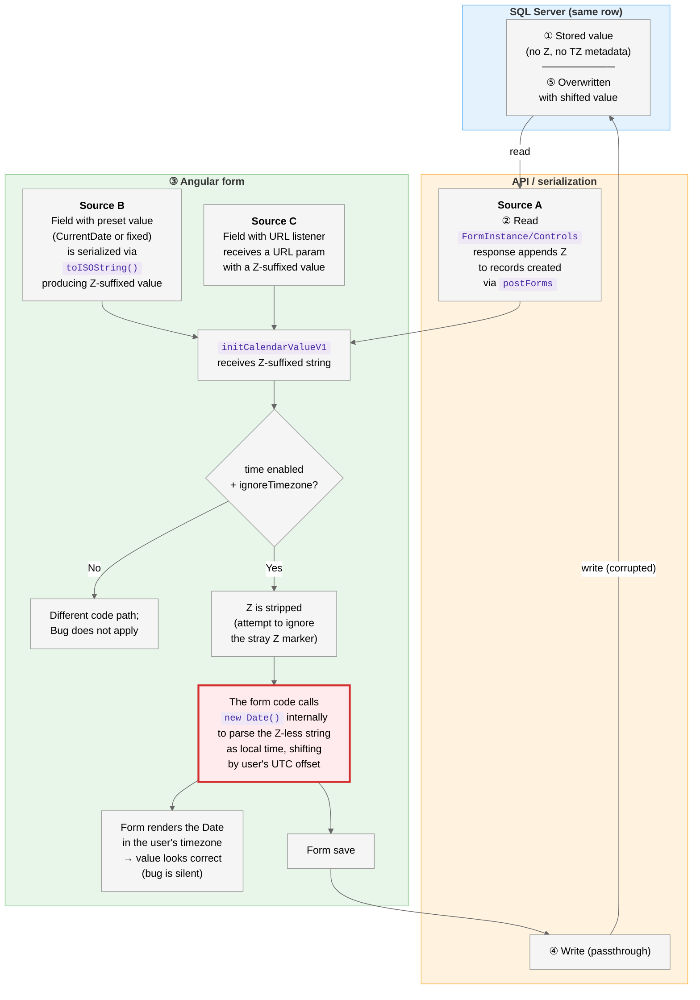

# Calendar Field Date Corruption via Timezone Stripping

## Summary

VisualVault form calendar fields silently corrupt stored date/time values when users open and save affected forms. The display shows the original value while the database is permanently shifted by the user's UTC offset. Affects fields with both "time enabled" and "ignore timezone" set — a common setting for local-time data.

## Workflow diagram

Read the diagram top-to-bottom, following the numbered steps ①–⑤. The red-bordered node marks where the defect occurs.

> **Important**:
>
> - Triggered by core VisualVault functionality — no user action on the field, no custom scripting.
> - Open triggers steps ②–③; save triggers ④–⑤, even with no edits.
> - Display looks correct during the session; corruption surfaces only when the form is reopened.

### Worked examples: user in PST (UTC−8)

Two starting values, same mechanism — Example 1 shifts time only; Example 2 rolls the date forward.

| Step      | Example 1: midnight value                                                                                   | Example 2: 8 pm value                                                                                       | What happens                                                               |
| --------- | ----------------------------------------------------------------------------------------------------------- | ----------------------------------------------------------------------------------------------------------- | -------------------------------------------------------------------------- |
| ①         | <code style="background:#e8f5e9;color:#1b5e20;padding:2px 6px;border-radius:3px">2026-03-15 00:00:00</code> | <code style="background:#e8f5e9;color:#1b5e20;padding:2px 6px;border-radius:3px">2026-03-15 20:00:00</code> | Stored in DB (naive, no Z, no TZ metadata)                                 |
| ②         | `2026-03-15T00:00:00.000Z`                                                                                  | `2026-03-15T20:00:00.000Z`                                                                                  | Read via `FormInstance/Controls` — response appends Z                      |
| ③ɑ        | `2026-03-15T00:00:00.000`                                                                                   | `2026-03-15T20:00:00.000`                                                                                   | `initCalendarValueV1` strips the Z                                         |
| ③β        | `2026-03-15T08:00:00.000Z`                                                                                  | `2026-03-16T04:00:00.000Z`                                                                                  | Parsed as PST local time → shifted by +8h in UTC _(internal value)_        |
| _display_ | <code style="background:#e3f2fd;color:#0d47a1;padding:2px 6px;border-radius:3px">2026-03-15 00:00</code>    | <code style="background:#e3f2fd;color:#0d47a1;padding:2px 6px;border-radius:3px">2026-03-15 20:00</code>    | Form renders the Date in user's TZ → **user sees original value** (silent) |
| ④         | `2026-03-15T08:00:00.000`                                                                                   | `2026-03-16T04:00:00.000`                                                                                   | Save path passes value through (Z stripped)                                |
| ⑤         | <code style="background:#ffebee;color:#b71c1c;padding:2px 6px;border-radius:3px">2026-03-15 08:00:00</code> | <code style="background:#ffebee;color:#b71c1c;padding:2px 6px;border-radius:3px">2026-03-16 04:00:00</code> | DB overwritten — value shifted forward by user's UTC offset (+8h for PST)  |

**Net corruption**:

- **Example 1** (midnight): time shifted from `00:00` to `08:00`. Same calendar day, but the field silently gained 8 hours.
- **Example 2** (8 pm): date shifted from March 15 to March 16. Any PST field value between `16:00` and `23:59` crosses into the next calendar day on the first corrupted load.
