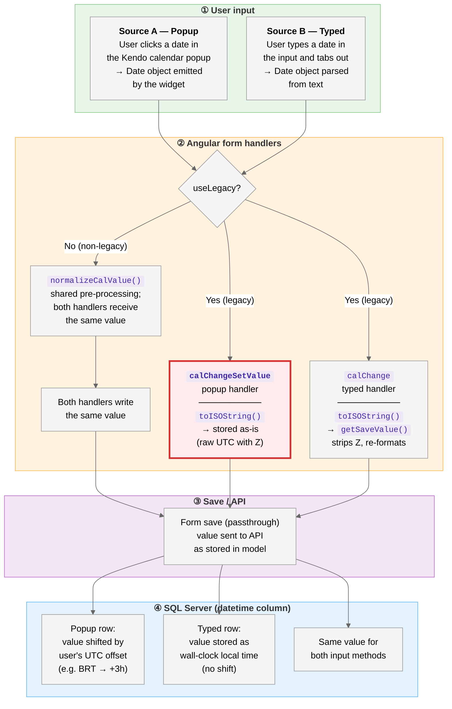

# Calendar Popup and Typed Input Store Different Values

## Summary

In legacy calendar fields, the **popup** and **typed** input handlers store different values for the same date. The popup writes a raw UTC timestamp (`toISOString()` output); the typed path runs the same value through `getSaveValue()`, which strips the timezone and re-formats. Non-legacy fields converge through a shared normalization step, so they are not affected. The display looks identical after reload (V1 re-parses the stored value), but the raw database value differs by the user's UTC offset — visible to any downstream consumer that reads the column directly (SQL, reports, dashboards, web services).

## Workflow diagram

Read the diagram top-to-bottom, following the numbered steps ①–④. The red-bordered node marks where the divergence occurs.

> **Important**:
>
> - Triggered the first time the user enters a date — no reopen required.
> - Only legacy fields (`useLegacy=true`) diverge. Non-legacy fields share `normalizeCalValue()` and converge to a single stored value.
> - `enableTime` and `ignoreTimezone` do **not** gate this bug — all four legacy configs (E/F/G/H) diverge.
> - At UTC+0 the two stored values are numerically identical; the bug is latent but invisible.
> - Display looks correct after save+reload because V1's init path re-parses whatever is stored; only consumers reading the raw DB column see the divergence.

### Worked examples: user in BRT (UTC−3), selects March 15, 2026

Two configurations, same mechanism — Example 1 is a date-only legacy field; Example 2 is a date+time legacy field.

| Step      | Example 1: date-only (Config E, Field12)                                                                    | Example 2: date+time (Config G, Field14)                                                                    | What happens                                                                             |
| --------- | ----------------------------------------------------------------------------------------------------------- | ----------------------------------------------------------------------------------------------------------- | ---------------------------------------------------------------------------------------- |
| ①         | User picks `2026-03-15`                                                                                     | User picks `2026-03-15 00:00`                                                                               | Same Date object emitted by the widget or parsed from typed text                         |
| ②ɑ popup  | `2026-03-15T03:00:00.000Z`                                                                                  | `2026-03-15T03:00:00.000Z`                                                                                  | `calChangeSetValue` stores raw `toISOString()` — no formatting                           |
| ②β typed  | `2026-03-15`                                                                                                | `2026-03-15T00:00:00`                                                                                       | `calChange` runs `getSaveValue()` — strips Z, formats to local wall-clock                |
| ③ popup   | `2026-03-15T03:00:00.000Z`                                                                                  | `2026-03-15T03:00:00.000Z`                                                                                  | Save path is a passthrough; value sent to API as stored                                  |
| ③ typed   | `2026-03-15`                                                                                                | `2026-03-15T00:00:00`                                                                                       | Save path is a passthrough                                                               |
| ④ popup   | <code style="background:#ffebee;color:#b71c1c;padding:2px 6px;border-radius:3px">2026-03-15 03:00:00</code> | <code style="background:#ffebee;color:#b71c1c;padding:2px 6px;border-radius:3px">2026-03-15 03:00:00</code> | DB stores 3 AM — the UTC equivalent of midnight BRT                                      |
| ④ typed   | <code style="background:#e8f5e9;color:#1b5e20;padding:2px 6px;border-radius:3px">2026-03-15 00:00:00</code> | <code style="background:#e8f5e9;color:#1b5e20;padding:2px 6px;border-radius:3px">2026-03-15 00:00:00</code> | DB stores midnight — the user's local wall-clock                                         |
| _display_ | <code style="background:#e3f2fd;color:#0d47a1;padding:2px 6px;border-radius:3px">2026-03-15</code>          | <code style="background:#e3f2fd;color:#0d47a1;padding:2px 6px;border-radius:3px">2026-03-15 00:00</code>    | Both rows render identically after reload — V1 re-parses the stored value to the user TZ |

**Net divergence**:

- **Example 1** (date-only): popup row is 3 hours ahead of typed row in the DB. SQL `WHERE date = '2026-03-15'` matches the typed row but not the popup row (which is `2026-03-15 03:00:00`).
- **Example 2** (date+time): same 3-hour offset. Reports that group by hour, or filters on time-of-day, split records into different buckets depending on how the date was entered.
- **Magnitude scales with user offset**: PST (UTC−8) → 8h shift, IST (UTC+5:30) → 5.5h shift in the opposite direction, UTC+0 → 0h (bug invisible).
